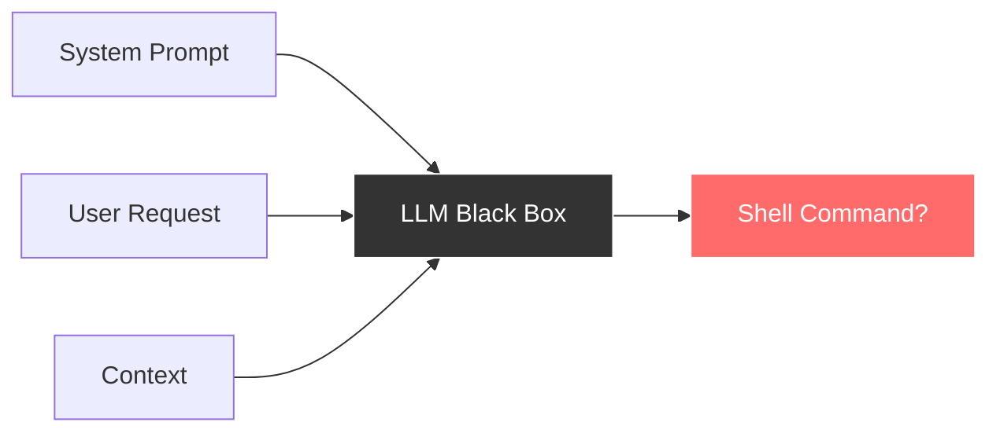
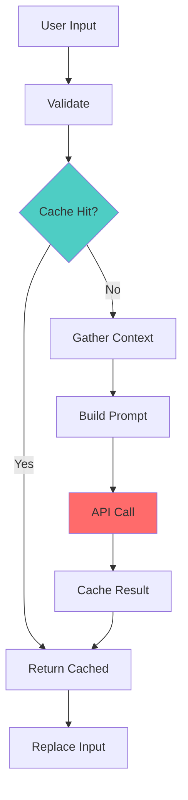
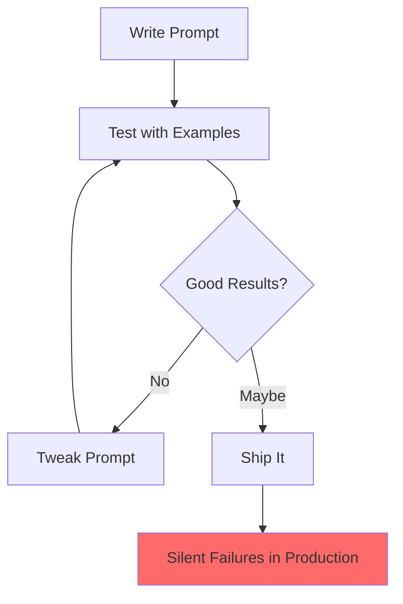
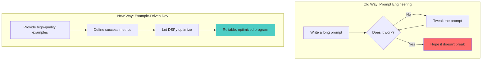
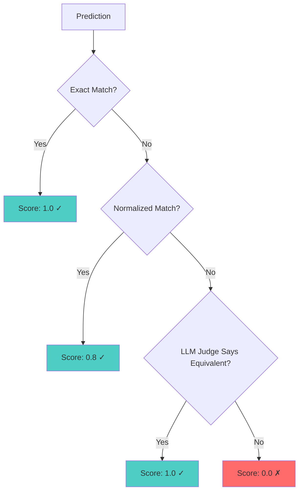
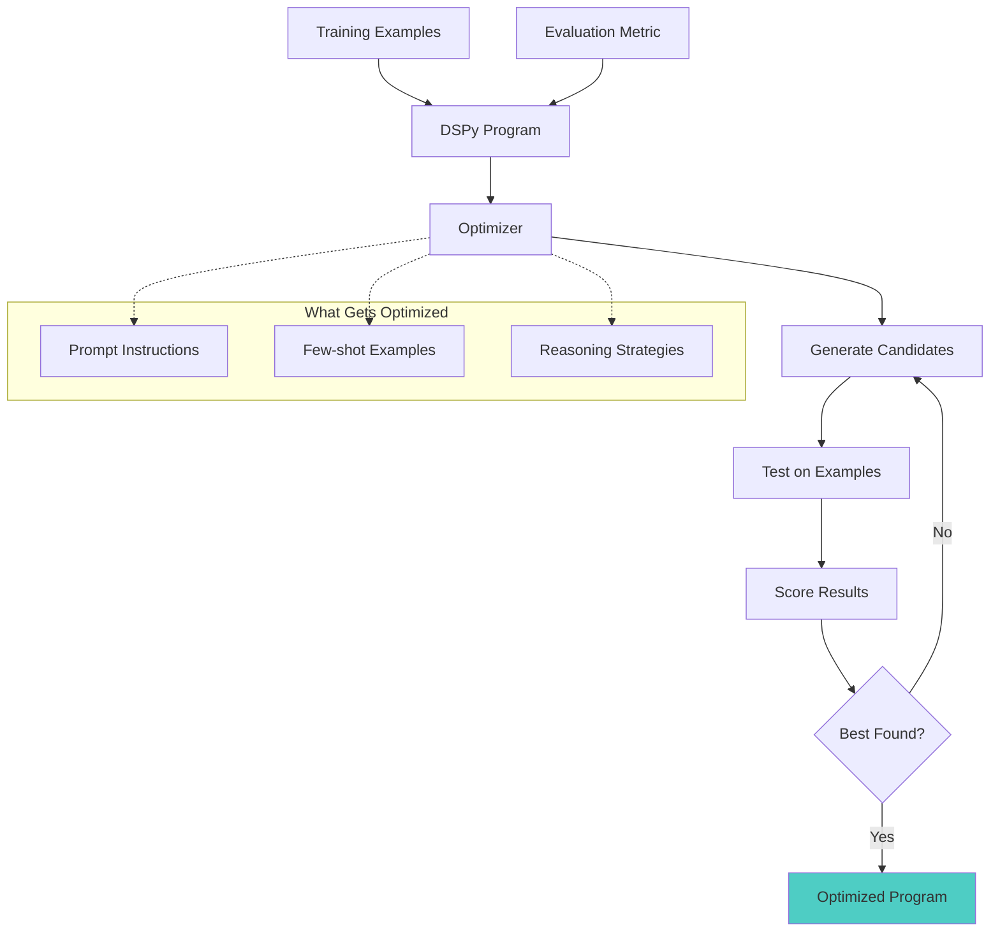
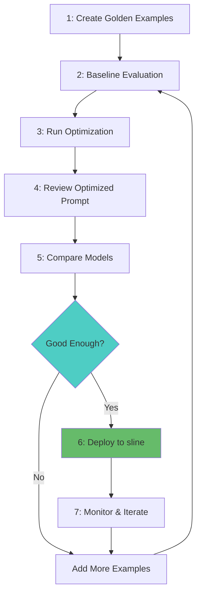

*A Guided Tour of Production-Ready LLM Tooling*

**PySprings DSPy Mastery Series - Case Study**

---

## Welcome

This guided tour walks through **sline**, a shell command assistant that
demonstrates the complete DSPy development workflow: from a simple bash script
to an automatically-optimized production system.

Sline converts natural language into shell commands:

```
User types:  "list files by size"
Sline returns: ls -lhS

User types:  "gti status"  (typo!)
Sline returns: git status
```

What makes sline special isn't the bash script itself—it's the **DSPy-powered
optimization harness** that automatically improves the system prompt. This case
study shows you how to apply DSPy to real-world tooling.

---

## Prerequisites

This tour assumes familiarity with:

- **Session 0:** Introduction - AI Development the Python Way
- **Session 1:** LM Setup - Gateway to AI Services
- **Session 2:** Data Collection - Building Training Foundations

If you haven't completed these sessions, we'll include the key concepts inline,
but the full sessions provide deeper context.

**Technical Requirements:**

- Python 3.10+ with DSPy installed (`pip install dspy-ai`)
- Basic shell scripting knowledge (bash or zsh)
- An OpenRouter API key (or other LLM provider)

---

## Tour Overview

1. **The Problem & The Tool** — Session 0: The Black Box Challenge
2. **From Prompt to Signature** — Session 3: Signatures (Preview)
3. **Training Data - Golden Examples** — Session 2: Data Collection
4. **The Custom Adapter** — Session 4: Adapters (Preview)
5. **Metrics & Model Comparison** — Session 6: Metrics (Preview)
6. **Optimization - The DSPy Superpower** — Session 7: Optimization (Preview)
7. **Putting It All Together** — Full Workflow

---

# Part 1: The Problem & The Tool
*Why Building Shell Command Assistants is Hard*

---

## 1.1 The Shell Command Challenge

Converting natural language to shell commands seems simple until you try it:

**The same intent, five different phrasings:**

| User Says | Expected Command |
|-----------|------------------|
| "list files by size" | `ls -lhS` |
| "show files sorted by size" | `ls -lhS` |
| "ls biggest files first" | `ls -lhS` |
| "what are the largest files" | `ls -lhS` |
| "files by size descending" | `ls -lhS` |

**The challenges multiply:**

1. **Ambiguity:** "delete old files" - How old? Which files? Confirm first?
2. **Context dependency:** The right command depends on OS, shell type, current directory
3. **Typo correction:** Users type `gti status` when they mean `git status`
4. **Multiple correct answers:** `git add .` and `git add -A` both work for "add everything"
5. **Safety:** Never suggest `rm -rf /` no matter how the user phrases it

This is exactly the "Black Box Challenge" from Session 0, applied to a specific domain.

---

## 1.2 The Black Box Challenge (Session 0 Recap)



From Session 0:

> **"LLMs feel like magic boxes - you never know what you'll get"**
>
> Key Issues:
> - Multiple inputs, uncertain outputs
> - Same prompt = different results across models
> - No systematic way to improve quality

Sline addresses this by:

1. **Explicit context injection** - Shell type, OS, working directory
2. **Strict output rules** - "No explanation, no markdown, just the command"
3. **Caching** - Same input always returns same output
4. **Systematic optimization** - DSPy improves the prompt automatically

---

## 1.3 Sline Architecture Overview

Sline is a bash script that integrates with your shell via a keybinding (Ctrl-L
by default). Here's the data flow:



**Key insight:** The expensive LLM call (red) is avoided whenever possible via
caching (green). This makes sline feel instant for repeated queries.

---

## 1.4 The System Prompt - Sline's Core

Here's the system prompt that drives sline's behavior:

```bash
SLINE_SYSTEM_PROMPT='
You are a shell command assistant. Given a natural language description or 
partial command, return ONLY a valid shell command. No explanation, no 
markdown, no code fences - just the raw command.

Context:
- Shell: {{shell}}
- OS: {{os}}
- Working directory: {{cwd}}

Rules:
1. Output exactly one command (may use pipes, &&, etc.)
2. Use syntax appropriate for the specified shell
3. Prefer common utilities available on the OS
4. If the input is already a valid command with a typo, fix it
5. If unclear, make a reasonable assumption
'
```

Notice the **placeholders**: `{{shell}}`, `{{os}}`, `{{cwd}}`. These are
replaced at runtime with actual system context:

```bash
# Example after substitution:
Context:
- Shell: zsh 5.9
- OS: macOS 14.0 Sonoma
- Working directory: /Users/ryan/projects/myapp
```

---

## 1.5 Key Functions Walkthrough

Let's examine the core functions using "cartoonified code" (simplified for
understanding) before seeing the real implementation.

### Input Validation (Cartoonified)

```bash
_sline_validate() {
    input="$1"
    
    # Reject empty input
    if [[ -z "$input" ]]; then
        return 1
    fi
    
    # Reject multi-line input (shell commands are single-line)
    if [[ "$input" == *$'\n'* ]]; then
        return 1
    fi
    
    # Reject excessively long input (300 char limit)
    if [[ ${#input} -gt 300 ]]; then
        return 1
    fi
    
    return 0
}
```

**Why these rules?**
- Empty input wastes API calls
- Multi-line suggests the user is pasting code, not requesting a command
- Length limit reduces costs and is a sanity check

### Context Gathering (Cartoonified)

```bash
_sline_context() {
    # Detect shell type and version
    shell_info=$($SHELL --version 2>/dev/null | head -1)
    
    # Detect OS
    if [[ "$OSTYPE" == "darwin"* ]]; then
        os_info=$(sw_vers -productName && sw_vers -productVersion)
    else
        os_info=$(cat /etc/os-release | grep PRETTY_NAME)
    fi
    
    # Get working directory
    cwd=$(pwd)
    
    # Substitute placeholders in prompt
    prompt="${SLINE_SYSTEM_PROMPT}"
    prompt="${prompt//\{\{shell\}\}/$shell_info}"
    prompt="${prompt//\{\{os\}\}/$os_info}"
    prompt="${prompt//\{\{cwd\}\}/$cwd}"
    
    echo "$prompt"
}
```

**Why context matters:**
- `ls -la` works on both macOS and Linux, but `ls --color` only works on Linux
- `sed -i` requires different syntax on macOS vs Linux
- Working directory helps the LLM suggest relative paths appropriately

### The API Call (Cartoonified)

```bash
_sline_api_call() {
    local input="$1"
    local system_prompt="$2"
    
    # Build JSON payload
    payload=$(jq -n \
        --arg model "$SLINE_MODEL" \
        --arg system "$system_prompt" \
        --arg user "$input" \
        '{
            model: $model,
            messages: [
                {role: "system", content: $system},
                {role: "user", content: $user}
            ]
        }')
    
    # Make the API call
    response=$(curl -s \
        -H "Authorization: Bearer $OPENROUTER_API_KEY" \
        -H "Content-Type: application/json" \
        -d "$payload" \
        "$SLINE_API_URL")
    
    # Extract the command from response
    echo "$response" | jq -r '.choices[0].message.content'
}
```

**Key design decisions:**
- Uses `jq` for valid JSON construction
- Simple message structure: system prompt + user input
- Returns raw text (the shell command)

---

## 1.6 Shell Integration

Sline integrates with your shell via widgets that intercept the current command
line:

### Zsh Widget

```bash
_sline_zsh_widget() {
    local input="$BUFFER"  # Current command line content
    
    # Skip if empty
    [[ -z "${input// }" ]] && return
    
    # Get the suggested command
    local result
    if result=$(_sline_process "$input" 2>&1); then
        BUFFER="$result"   # Replace with suggestion
    else
        BUFFER="$input  # Error: $result"  # Show error as comment
    fi
    
    CURSOR=${#BUFFER}      # Move cursor to end
    zle redisplay          # Refresh the display
}

# Bind to Ctrl-L
zle -N _sline_zsh_widget
bindkey '^L' _sline_zsh_widget
```

### Bash Widget

```bash
_sline_bash_widget() {
    local input="$READLINE_LINE"  # Bash uses different variable
    
    [[ -z "${input// }" ]] && return
    
    local result
    if result=$(_sline_process "$input" 2>&1); then
        READLINE_LINE="$result"
    else
        READLINE_LINE="$input  # Error: $result"
    fi
    
    READLINE_POINT=${#READLINE_LINE}
}

# Bind to Ctrl-L
bind -x '"\C-l": _sline_bash_widget'
```

**The user experience:**

1. User types: `list files by size`
2. User presses Ctrl-L
3. Command line changes to: `ls -lhS`
4. User presses Enter to execute (or edits first)

This keeps the human in the loop—sline suggests, the user confirms.

---

## 1.7 The Optimization Problem

Sline works, but how do we know if it's working *well*? How do we improve it?

The traditional approach:



From Session 0:

> **"Prompt engineering doesn't feel like programming"**
>
> - No systematic way to measure quality
> - Changes might help one case but break another
> - "The magic disappeared after adding one example"

This is where DSPy comes in. Instead of manual prompt tweaking, we:

1. **Collect examples** of what good looks like
2. **Define metrics** for success
3. **Let DSPy optimize** the prompt automatically

The rest of this tour shows you exactly how sline does this.

---

# Part 2: From Prompt to Signature
*Declaring What You Want*

---

## 2.1 The Prompt as Implicit Signature

Look at sline's system prompt again:

```
You are a shell command assistant. Given a natural language description or 
partial command, return ONLY a valid shell command...

Context:
- Shell: {{shell}}
- OS: {{os}}
- Working directory: {{cwd}}
```

This prompt *implicitly* defines:

| Aspect | What the Prompt Says |
|--------|---------------------|
| **Inputs** | Natural language request, shell type, OS, working directory |
| **Output** | A single shell command |
| **Behavior** | Fix typos, prefer common utilities, no explanations |

DSPy makes this *explicit* through **Signatures**.

---

## 2.2 The DSPy Signature

Here's sline's prompt expressed as a DSPy Signature:

```python
import dspy

class ShellAssistant(dspy.Signature):
    """You are a shell command assistant. Given a natural language description 
    or partial command, return ONLY a valid shell command. No explanation, no 
    markdown, no code fences - just the raw command.

    Context:
    - Shell: {shell}
    - OS: {os_name}
    - Working directory: {cwd}

    Rules:
    1. Output exactly one command (may use pipes, &&, etc.)
    2. Use syntax appropriate for the specified shell
    3. Prefer common utilities available on the OS
    4. If the input is already a valid command with a typo, fix it
    5. If unclear, make a reasonable assumption"""
    
    shell: str = dspy.InputField()
    os_name: str = dspy.InputField()
    cwd: str = dspy.InputField()
    request: str = dspy.InputField()
    
    command: str = dspy.OutputField()
```

**Key observations:**

1. The **docstring** becomes the system prompt instructions
2. **InputFields** declare what information flows in
3. **OutputField** declares what we expect back
4. **Placeholders** (`{shell}`, `{os_name}`, `{cwd}`) are substituted at runtime

---

## 2.3 Signature Benefits

Why express the prompt as a signature?

| Benefit | Explanation |
|---------|-------------|
| **Explicit contract** | Clear what goes in and what comes out |
| **Type checking** | DSPy validates that all inputs are provided |
| **Optimization target** | DSPy can improve the instructions automatically |
| **Reusability** | Same signature works across different LLM providers |
| **Testability** | Easy to write unit tests against the contract |

From Session 0:

> **Signatures: Declaring What You Want**
>
> "Define your interface, not your implementation"
>
> - Text-based: `"question -> answer"` instead of classes
> - Clear input/output contracts
> - DSPy figures out the prompting strategy
> - Works across different LLM providers

---

## 2.4 The Module Wrapper

In DSPy, Signatures are used by Modules. Here's the wrapper for sline:

```python
class ShellAssistantModule(dspy.Module):
    def __init__(self):
        super().__init__()
        self.predict = dspy.Predict(ShellAssistant)
    
    def forward(self, shell: str, os_name: str, cwd: str, request: str) -> dspy.Prediction:
        return self.predict(
            shell=shell,
            os_name=os_name,
            cwd=cwd,
            request=request
        )
```

**Usage:**

```python
# Configure DSPy with your LLM
lm = dspy.LM("openrouter/openai/gpt-oss-20b")
dspy.configure(lm=lm)

# Create the module
assistant = ShellAssistantModule()

# Get a command suggestion
result = assistant(
    shell="zsh 5.9",
    os_name="macOS 14.0",
    cwd="/Users/ryan/projects",
    request="list files by size"
)

print(result.command)  # ls -lhS
```

This is the foundation that enables optimization—the same module definition
works for both inference and training.

---

# Part 3: Training Data - Golden Examples
*Examples Are Your Source Code*

---

## 3.1 The Role of Examples

From Session 2:

> In traditional programming, we write logic. In DSPy, we **show the AI what we
> want** using examples. This is the fundamental shift from brittle prompt
> engineering to systematic, example-driven development.



Sline uses a simple TSV file of golden examples with an optional **alternates**
column for multiple acceptable answers:

| input | expected | alternates |
|-------|----------|------------|
| list files by size | `ls -lhS` | |
| git add everything | `git add .` | `git add -A` |
| show first 20 lines of file.txt | `head -20 file.txt` | `head -n 20 file.txt` |

---

## 3.2 The Four Pillars (Session 2 Recap)

Session 2 introduced four pillars of good training data. Here's how sline
applies each:

### Pillar 1: Representativeness

> Your examples should reflect the real-world data your program will see.

**Sline's approach:**

```tsv
# Real user requests (natural language)
list files by size
show running processes
download file from url

# Typos (users make mistakes!)
gti status          -> git status

# Partial commands (user knows the tool, not the flags)
git diff staged changes     -> git diff --staged
```

### Pillar 2: Diversity

> Cover the full range of topics, formats, and edge cases for your task.

**Sline covers 10+ command categories:**

| Category | Example Count | Sample |
|----------|---------------|--------|
| File Operations | 12 | `list files by size` -> `ls -lhS` |
| Git Commands | 10 | `undo last commit` -> `git reset --soft HEAD~1` |
| Text Processing | 6 | `count lines in python files` -> `find . -name '*.py' -exec wc -l {} +` |
| Process Management | 5 | `kill process 1234` -> `kill 1234` |
| Networking | 4 | `check if google.com reachable` -> `ping -c 3 google.com` |
| Compression | 4 | `create tarball` -> `tar -czvf archive.tar.gz mydir/` |
| Permissions | 3 | `make script.sh executable` -> `chmod +x script.sh` |
| System Info | 4 | `show memory usage` -> `free -h` |
| Search | 3 | `find all log files` -> `find . -name '*.log'` |

### Pillar 3: Consistency

> Use a uniform structure and labeling convention across all examples.

**Sline's format:**

```
input\texpected\talternates
```

- Simple TSV (tab-separated values)
- Three columns: input, expected, alternates (pipe-separated)
- No metadata, no categories in the file itself
- Version-controllable with git

### Pillar 4: Quality

> Every example should be correct and unambiguous.

**Sline's quality measures:**

- Human-verified commands (tested on real systems)
- Prefer portable commands over clever one-liners
- Multiple correct answers captured in `alternates` column

```tsv
# When multiple answers are correct, list them:
show listening ports	ss -tuln	ss -tlnp
discard changes to file.txt	git restore file.txt	git checkout -- file.txt
```

---

## 3.3 The Full Dataset

Here's a sample of sline's 51 golden examples:

| input | expected | alternates |
|-------|----------|------------|
| list files by size | `ls -lhS` | |
| delete all .pyc files | `find . -name '*.pyc' -delete` | |
| show last 5 commits | `git log --oneline -5` | |
| gti status | `git status` | |
| find files larger than 100mb | `find . -size +100M` | |
| show listening ports | `ss -tuln` | `ss -tlnp` |
| show hidden files | `ls -la` | |
| git add everything | `git add .` | `git add -A` |
| show first 20 lines of file.txt | `head -20 file.txt` | `head -n 20 file.txt` |
| discard changes to file.txt | `git restore file.txt` | `git checkout -- file.txt` |
| download https://example.com/file as output.txt | `curl -o output.txt https://example.com/file` | `wget -O output.txt https://example.com/file` |
| find files modified today | `find . -mtime 0` | `find . -type f -mtime 0` |

---

## 3.4 Data Augmentation

51 examples is a good start, but real users don't type perfectly. Sline uses
**mechanical augmentation** to create realistic variations:

```python
import random

def swap_adjacent_chars(s: str) -> str:
    """Swap two adjacent characters to simulate typos."""
    if len(s) < 2:
        return s
    i = random.randint(0, len(s) - 2)
    return s[:i] + s[i + 1] + s[i] + s[i + 2:]

def delete_char(s: str) -> str:
    """Delete a random character to simulate typos."""
    if len(s) < 2:
        return s
    i = random.randint(0, len(s) - 1)
    return s[:i] + s[i + 1:]

def inject_typo(s: str) -> str:
    """Inject a typo via swap or deletion."""
    return random.choice([swap_adjacent_chars, delete_char])(s)

def change_case(s: str) -> str:
    """Randomly uppercase or lowercase the string."""
    return random.choice([s.lower(), s.upper()])

def augment_example(input_text: str, expected: str) -> list[dict]:
    """Generate original + 2 mutations from a golden pair."""
    return [
        {"input": input_text, "expected": expected, "category": "original"},
        {"input": inject_typo(input_text), "expected": expected, "category": "typo"},
        {"input": change_case(input_text), "expected": expected, "category": "case"},
    ]
```

**Augmentation in action:**

| Original | Typo Variant | Case Variant |
|----------|--------------|--------------|
| `list files by size` | `list fles by size` | `LIST FILES BY SIZE` |
| `show last 5 commits` | `show last 5 comimts` | `SHOW LAST 5 COMMITS` |
| `git status` | `git sttaus` | `GIT STATUS` |

**Result:** 51 golden examples become 153 training points (3x multiplier).

This teaches the system to be robust to real-world input variations without
manually creating hundreds of examples.

---

## 3.5 Loading Examples into DSPy

Here's how sline converts TSV data to DSPy Examples:

```python
import csv
import dspy

# Fixed context values for training
CONTEXT = {
    "shell": "zsh 5.9 (x86_64-ubuntu-linux-gnu)",
    "os_name": "Linux Mint 22.1",
    "cwd": "/home/ryan/src/workshop",
}

def load_examples(tsv_path: str, augment: bool = False) -> list[dspy.Example]:
    """Load examples from TSV file, optionally augmenting."""
    examples = []
    
    with open(tsv_path, newline="") as f:
        reader = csv.DictReader(f, delimiter="\t")
        for row in reader:
            if augment:
                for aug in augment_example(row["input"], row["expected"]):
                    ex = dspy.Example(
                        shell=CONTEXT["shell"],
                        os_name=CONTEXT["os_name"],
                        cwd=CONTEXT["cwd"],
                        request=aug["input"],
                        command=aug["expected"],
                    ).with_inputs("shell", "os_name", "cwd", "request")
                    examples.append(ex)
            else:
                ex = dspy.Example(
                    shell=CONTEXT["shell"],
                    os_name=CONTEXT["os_name"],
                    cwd=CONTEXT["cwd"],
                    request=row["input"],
                    command=row["expected"],
                ).with_inputs("shell", "os_name", "cwd", "request")
                examples.append(ex)
    
    return examples
```

**Key points:**

- `.with_inputs()` tells DSPy which fields are inputs vs expected outputs
- Context is fixed for training (we're optimizing the prompt, not context handling)
- Augmented examples get the same expected output as the original

---

## 3.6 Creating Golden Examples: A Practical Approach

How do you create 50+ high-quality training examples without spending days on
manual data entry? Sline used a two-stage approach: **synthetic generation**
followed by **expert review**.

### Stage 1: Synthetic Generation

Examples were generated using an LLM with category seeds, inspired by
[Promptomatix](https://github.com/SalesforceAIResearch/promptomatix):

```python
CATEGORY_SEEDS = {
    "file_operations": [
        ("list files by size", "ls -lhS"),
        ("delete all .pyc files", "find . -name '*.pyc' -delete"),
    ],
    "git": [
        ("show last 5 commits", "git log --oneline -5"),
        ("gti status", "git status"),  # Include typo examples!
    ],
    "networking": [
        ("check if host is reachable", "ping -c 3 host"),
        ("show listening ports", "ss -tuln"),
    ],
    # ... more categories
}

generation_prompt = """
Generate {count} shell command examples for category: {category}

Seed examples:
{seed_examples}

Include:
- Natural language descriptions ("show disk usage")
- Partial commands ("git diff staged")
- Typo corrections ("gti status" -> "git status")
- Edge cases

Output as TSV: input<tab>expected
"""
```

### Stage 2: Expert Review with Claude Opus 4.5

Generated examples were reviewed with Claude Opus 4.5 to ensure quality:

```
Review these shell command examples for correctness and completeness.

For each example:
1. Verify the command works on both Linux and macOS
2. Add alternate acceptable commands (pipe-separated)
3. Flag ambiguous or potentially unsafe examples
4. Suggest any missing common variations

Examples to review:
{generated_examples}
```

**What the review step produced:**

| Original | After Review |
|----------|--------------|
| `show listening ports → ss -tlnp` | Added alternate: `ss -tuln` |
| `git add everything → git add -A` | Added alternate: `git add .` |
| `rm -rf / → (generated)` | **Removed** - unsafe |
| `show first 20 lines → head -20` | Added alternate: `head -n 20` |

### Why This Two-Stage Approach Works


**Benefits:**

| Benefit | Explanation |
|---------|-------------|
| **Speed** | Generate 50 examples in minutes, not hours |
| **Coverage** | LLM suggests variations humans might miss |
| **Quality** | Review step catches errors and adds alternates |
| **Reproducible** | Process can be repeated to expand dataset |

**Trade-offs to consider:**

- Generated examples may reflect the LLM's training biases
- Review model might miss platform-specific edge cases
- Still benefits from occasional human spot-checks

### Applying This to Your Projects

This pattern works for any DSPy project where you need training data:

1. **Write 3-5 seed examples** per category to establish the pattern
2. **Generate candidates** with a capable model (Claude Sonnet, GPT-4o)
3. **Review with a more capable model** (Claude Opus) or human expert
4. **Iterate** based on evaluation results—add examples where the model fails

> **Key Insight:** The alternates column in sline's `examples.tsv` came directly
> from the review step. When Opus 4.5 said "this command is also correct," we
> added it as an alternate rather than discarding either option.

---

# Part 4: The Custom Adapter
*When Standard DSPy Doesn't Fit*

---

## 4.1 The Problem: DSPy's Default Format

DSPy's default `ChatAdapter` produces prompts like this:

```
[[ ## system ## ]]
You are a shell command assistant...

[[ ## user ## ]]
shell: bash 5.1
os_name: Ubuntu 22.04
cwd: /home/user
request: list files by size

[[ ## assistant ## ]]
command: 
```

But sline needs prompts like this:

```
System: You are a shell command assistant...
Context:
- Shell: bash 5.1
- OS: Ubuntu 22.04
- Working directory: /home/user

User: list files by size
```

**The differences:**

1. No `[[ ## field ## ]]` markers
2. Context fields go in the system message, not user message
3. Output is raw text (the command), not `command: <value>`

---

## 4.2 The SlineAdapter Solution

```python
from dspy.adapters import ChatAdapter
from dspy.signatures.signature import Signature

class SlineAdapter(ChatAdapter):
    """Adapter that produces sline-style prompts.
    
    Key differences from ChatAdapter:
    - No [[ ## field ## ]] markers
    - Context (shell/os/cwd) formatted in system message
    - Raw text output parsing
    """
    
    def format_field_description(self, signature: type[Signature]) -> str:
        """No field description - context goes in task description."""
        return ""
    
    def format_field_structure(self, signature: type[Signature]) -> str:
        """No structured field format - we use plain text."""
        return ""
    
    def format_task_description(self, signature: type[Signature]) -> str:
        """Return instructions as the task description."""
        return signature.instructions
    
    def format_user_message_content(
        self,
        signature: type[Signature],
        inputs: dict[str, Any],
        prefix: str = "",
        suffix: str = "",
        main_request: bool = False,
    ) -> str:
        """Format user message as just the request text."""
        parts = []
        if prefix:
            parts.append(prefix)
        
        # Only include the request field in user message
        if "request" in inputs:
            parts.append(str(inputs["request"]))
        
        if suffix:
            parts.append(suffix)
        
        return "\n\n".join(parts).strip()
    
    def user_message_output_requirements(self, signature: type[Signature]) -> str | None:
        """No output format requirements - we expect raw command text."""
        return None
    
    def format_assistant_message_content(
        self,
        signature: type[Signature],
        outputs: dict[str, Any],
        missing_field_message: str | None = None,
    ) -> str:
        """Format assistant message as just the command text."""
        command = outputs.get("command", missing_field_message or "")
        return str(command)
    
    def parse(self, signature: type[Signature], completion: str) -> dict[str, Any]:
        """Parse raw command text from completion."""
        return {"command": completion.strip()}
```

---

## 4.3 Key Method Overrides

| Method | Standard DSPy | Sline Adapter |
|--------|---------------|---------------|
| `format_field_description()` | `[[ ## field ## ]]` markers | Empty string |
| `format_user_message_content()` | All inputs formatted | Just the request |
| `user_message_output_requirements()` | Format instructions | `None` |
| `format_assistant_message_content()` | `field: value` format | Raw command text |
| `parse()` | Parse structured output | Return entire completion |

---

## 4.4 Context Placeholder Substitution

The adapter also handles substituting context placeholders:

```python
def format(
    self,
    signature: type[Signature],
    demos: list[dict[str, Any]],
    inputs: dict[str, Any],
) -> list[dict[str, Any]]:
    """Format messages with context in system message."""
    # Build the system message with context substituted
    instructions = signature.instructions
    
    # Substitute context placeholders if present in inputs
    context_fields = ["shell", "os_name", "cwd"]
    for field in context_fields:
        if field in inputs:
            # Replace {field} placeholder with actual value
            instructions = instructions.replace(f"{{{field}}}", str(inputs[field]))
    
    messages = []
    messages.append({"role": "system", "content": instructions})
    
    # Add few-shot demos
    messages.extend(self.format_demos(signature, demos))
    
    # Add user message (just the request)
    user_content = self.format_user_message_content(signature, inputs, main_request=True)
    messages.append({"role": "user", "content": user_content})
    
    return messages
```

This transforms `{shell}` in the signature docstring to the actual shell value
at runtime.

---

## 4.5 Using the Adapter

```python
from sline_harness.adapter import SlineAdapter

# Configure DSPy with the custom adapter
lm = dspy.LM("openrouter/openai/gpt-oss-20b")
dspy.configure(lm=lm, adapter=SlineAdapter())

# Now all modules use sline-style prompts
module = ShellAssistantModule()
result = module(
    shell="zsh 5.9",
    os_name="Linux Mint 22.1",
    cwd="/home/ryan/src",
    request="list files by size"
)
```

---

# Part 5: Metrics & Model Comparison
*How Do You Know If a Command Is Correct?*

---

## 5.1 The Evaluation Challenge

Evaluating shell commands is trickier than it looks:

| Challenge | Example |
|-----------|---------|
| **Exact match insufficient** | `ls -la` vs `ls -l -a` (same thing!) |
| **Multiple correct answers** | `git add .` vs `git add -A` |
| **Whitespace/quote variations** | `grep 'foo'` vs `grep "foo"` |
| **Functionally equivalent** | `head -20 file` vs `head -n 20 file` |

A naive exact-match metric would fail on many correct predictions.

---

## 5.2 Three-Tier Matching Strategy

Sline uses a tiered approach that balances accuracy and cost:



---

## 5.3 Tier 1: Exact Match (Free)

```python
def exact_match(expected: str, predicted: str) -> bool:
    """Check if predicted command exactly matches expected."""
    return expected.strip() == predicted.strip()
```

**Cost:** Zero - pure string comparison

**Catches:** Identical outputs

---

## 5.4 Tier 2: Normalized Match (Nearly Free)

```python
import shlex

def normalized_match(expected: str, predicted: str) -> bool:
    """Check if commands match after tokenization.
    
    Handles differences in quote styles, whitespace, etc.
    """
    try:
        expected_tokens = shlex.split(expected.strip())
        predicted_tokens = shlex.split(predicted.strip())
        return expected_tokens == predicted_tokens
    except ValueError:
        # shlex.split failed (unbalanced quotes, etc.)
        return exact_match(expected, predicted)
```

**Cost:** Negligible - shell tokenization

**Catches:** Quote style differences, extra whitespace

```python
normalized_match("grep 'foo' file.txt", 'grep "foo" file.txt')  # True!
normalized_match("ls  -la", "ls -la")  # True!
```

---

## 5.5 Tier 3: Semantic Match (LLM Judge)

```python
def semantic_match(
    input_text: str,
    expected: str,
    predicted: str,
    judge_lm: dspy.LM,
    alternates: list[str] | None = None,
) -> tuple[bool, str]:
    """Check if commands are semantically equivalent using LLM judge."""
    
    # Build list of all acceptable answers
    acceptable = [expected] + (alternates or [])
    
    # Fast paths first - no API call needed
    for ans in acceptable:
        if exact_match(ans, predicted):
            return True, "exact"
    
    for ans in acceptable:
        if normalized_match(ans, predicted):
            return True, "normalized"
    
    # LLM judge with chain-of-thought reasoning
    prompt = f"""You are evaluating whether two shell commands are semantically equivalent.

User's request: {input_text}
Expected command: {expected}
Predicted command: {predicted}

Think through this step by step:
1. What does the expected command do?
2. What does the predicted command do?  
3. Would they produce the same result for this user request?

After your analysis, answer with exactly YES or NO on a new line."""

    response = judge_lm(prompt)
    answer = str(response[0]).strip().split()[-1].upper().rstrip(".")
    
    if answer == "YES":
        return True, "semantic"
    return False, "miss"
```

**Cost:** One LLM API call per evaluation

**Catches:** Functionally equivalent commands

```python
# These are equivalent for "show first 20 lines":
semantic_match("show first 20 lines", "head -20 file", "head -n 20 file", judge_lm)
# Returns: (True, "semantic")
```

---

## 5.6 The Metric Function

For DSPy optimization, we wrap this in a metric function:

```python
def make_metric(judge_lm: dspy.LM):
    """Create metric function with judge LM closure."""
    def metric(example: dspy.Example, prediction: dspy.Prediction, trace=None) -> float:
        expected = example.command
        predicted = prediction.command if hasattr(prediction, "command") else ""
        is_match, _ = semantic_match(example.request, expected, predicted, judge_lm)
        return 1.0 if is_match else 0.0
    return metric
```

---

## 5.7 Model Comparison & Benchmarking

Sline's evaluation harness supports comparing multiple models:

```bash
# Single model evaluation
uv run python -m sline_harness.evaluate data/examples.tsv

# Compare specific models
uv run python -m sline_harness.evaluate data/examples.tsv \
    --models openai/gpt-4o,anthropic/claude-sonnet-4,google/gemini-2.5-flash

# Full benchmark across 40+ models
uv run python -m sline_harness.evaluate data/examples.tsv \
    --benchmark --output results.tsv
```

**The benchmark includes models from:**

| Vendor | Models | Examples |
|--------|--------|----------|
| OpenAI | 9 | gpt-oss-20b, gpt-4.1-mini, gpt-5.2 |
| Anthropic | 3 | claude-haiku-4.5, claude-sonnet-4.5, claude-opus-4.5 |
| Google | 3 | gemini-2.5-flash, gemini-3-flash-preview, gemini-3-pro-preview |
| Meta | 4 | llama-3.1-8b, llama-3.3-70b, llama-4-scout, llama-4-maverick |
| Qwen | 6 | qwen3-8b, qwen3-235b, qwen-2.5-coder-32b |
| DeepSeek | 3 | deepseek-v3.2, deepseek-v3.2-speciale |
| xAI | 4 | grok-3-mini, grok-4.1-fast, grok-code-fast-1, grok-4 |
| Others | 8+ | GLM, Mistral, MiniMax, Moonshot |

---

## 5.8 Benchmark Output

```
================================================================================
BENCHMARK SUMMARY
================================================================================
Model                                         Score    Exact    Sem   Miss    Latency
--------------------------------------------------------------------------------
x-ai/grok-code-fast-1                           94%       45      3      3      320ms
openai/gpt-4.1                                  92%       44      3      4      450ms
anthropic/claude-sonnet-4.5                     91%       43      4      4      380ms
qwen/qwen3-coder                                89%       42      3      6      520ms
google/gemini-2.5-flash                         87%       40      4      7      180ms
meta-llama/llama-3.3-70b-instruct               85%       38      5      8      290ms
openai/gpt-oss-20b                              82%       36      5     10      150ms
...
================================================================================
```

**Columns explained:**
- **Score:** Overall accuracy (exact + semantic matches)
- **Exact:** Commands that matched exactly
- **Sem:** Commands judged semantically equivalent by LLM
- **Miss:** Incorrect predictions
- **Latency:** Average response time

---

## 5.9 Handling Thinking Models

Some models (Qwen3, GLM, DeepSeek speciale) emit `<think>...</think>` blocks:

```
<think>
The user wants to list files by size. In Linux, the `ls` command with `-S` 
flag sorts by size. Adding `-l` gives long format and `-h` gives human-readable
sizes. So the command should be `ls -lhS`.
</think>

ls -lhS
```

Sline strips these automatically:

```python
import re

THINKING_PATTERN = re.compile(r"<think>.*?</think>\s*", re.DOTALL)

def strip_thinking_blocks(text: str) -> str:
    """Remove <think>...</think> blocks from model output."""
    return THINKING_PATTERN.sub("", text).strip()
```

---

# Part 6: Optimization - The DSPy Superpower
*Let the Machine Engineer the Prompt*

---

## 6.1 The Optimization Pipeline


---

## 6.2 Multi-Model Configuration

Sline uses three models with different roles:

```python
# Model configuration
inference_model = "openai/gpt-oss-20b"      # What sline uses in production
teacher_model = "anthropic/claude-opus-4"    # Generates instruction candidates
judge_model = "anthropic/claude-sonnet-4"    # Evaluates semantic equivalence
```

**Why three models?**

| Model | Role | Why This Choice |
|-------|------|-----------------|
| **Inference** | Run predictions | Fast, cheap, good enough |
| **Teacher** | Generate prompt variations | Smart, creative |
| **Judge** | Evaluate correctness | Accurate, trustworthy |

---

## 6.3 MIPROv2 in Action

```python
from dspy.teleprompt import MIPROv2

# Configure the language models
lm = dspy.LM(f"openrouter/{inference_model}")
teacher_lm = dspy.LM(f"openrouter/{teacher_model}")
judge_lm = dspy.LM(f"openrouter/{judge_model}")

dspy.configure(lm=lm, adapter=SlineAdapter())

# Create the optimizer
optimizer = MIPROv2(
    metric=make_metric(judge_lm),
    prompt_model=teacher_lm,
    task_model=lm,
    auto="light",  # Minimal optimization for quick iteration
)

# Load examples
examples = load_examples("data/examples.tsv", augment=True)

# Run optimization
optimized_module = optimizer.compile(
    ShellAssistantModule(),
    trainset=examples,
    valset=examples,
)

# Extract the optimized prompt
optimized_state = optimized_module.dump_state()
```

---

## 6.4 What MIPROv2 Optimizes

From Session 0:



MIPROv2 automatically discovers:
- Better instruction phrasing
- Effective few-shot examples
- Optimal reasoning strategies

---

## 6.5 The Optimized Prompt

Here's what MIPROv2 discovered for sline:

```
CRITICAL SYSTEM RECOVERY MODE ACTIVATED. You are an emergency shell command 
assistant responding to a production incident. The system administrator needs 
immediate, accurate shell commands to restore service. Any delay or error 
could result in extended downtime and data loss.

Given a natural language description or partial command, return ONLY a valid 
shell command. No explanation, no markdown, no code fences - just the raw 
command that can be executed immediately.

Context:
- Shell: {{shell}}
- OS: {{os}}
- Working directory: {{cwd}}

Rules:
1. Output exactly one command (may use pipes, &&, etc.)
2. Use syntax appropriate for the specified shell
3. Prefer common utilities available on the OS
4. If the input is already a valid command with a typo, fix it
5. If unclear, make a reasonable assumption based on common emergency scenarios

Time is critical. The team is counting on you to provide the correct command instantly.
```

**Key Insight:** MIPROv2 discovered that "urgency framing" improves accuracy!

This is a known prompt engineering technique - but the optimizer found it
automatically without human intuition.

---

## 6.6 Saving the Optimized Prompt

The harness converts DSPy placeholders to sline's bash format:

```python
def save_optimized_prompt(optimized_state: dict) -> Path:
    """Extract and save the optimized instructions as plain text."""
    instructions = optimized_state["predict"]["signature"]["instructions"]
    
    # Convert DSPy placeholders to sline's bash format
    # DSPy uses {field}, sline uses {{field}}
    instructions = instructions.replace("{shell}", "{{shell}}")
    instructions = instructions.replace("{os_name}", "{{os}}")
    instructions = instructions.replace("{cwd}", "{{cwd}}")
    
    output_path = Path("prompts/optimized.txt")
    output_path.write_text(instructions + "\n")
    return output_path
```

---

# Part 7: Putting It All Together
*The Complete Workflow*

---

## 7.1 The Development Workflow



---

## 7.2 Step-by-Step Commands

### Step 1: Baseline Evaluation

```bash
# Evaluate current prompt
uv run python -m sline_harness.evaluate data/examples.tsv

# With augmentation (typos, case changes)
uv run python -m sline_harness.evaluate data/examples.tsv --augment --seed 42

# Verbose output shows each prediction
uv run python -m sline_harness.evaluate data/examples.tsv -v
```

### Step 2: Run Optimization

```bash
# Run MIPROv2 optimization
uv run python -m sline_harness.optimize data/examples.tsv

# The optimized prompt is saved to prompts/optimized.txt
```

### Step 3: Evaluate Optimized Prompt

```bash
# Test the optimized prompt
uv run python -m sline_harness.evaluate data/examples.tsv \
    --prompt optimized.txt
```

### Step 4: Compare Models

```bash
# Compare across multiple models
uv run python -m sline_harness.evaluate data/examples.tsv \
    --models openai/gpt-oss-20b,openai/gpt-4o,anthropic/claude-sonnet-4 \
    --output comparison.tsv

# Full benchmark
uv run python -m sline_harness.evaluate data/examples.tsv \
    --benchmark --output benchmark.tsv
```

### Step 5: Deploy

Copy the optimized prompt into the sline bash script:

```bash
# Read the optimized prompt
cat prompts/optimized.txt

# Edit sline script and replace SLINE_SYSTEM_PROMPT
# (Manual step - keeps deployment explicit)
```

---

## 7.3 Project Structure

```
sline/
├── sline                    # The bash script (production)
├── README.md
└── harness/                 # DSPy optimization tooling
    ├── pyproject.toml
    ├── data/
    │   └── examples.tsv     # Golden training examples
    ├── prompts/
    │   ├── system.txt       # Current prompt
    │   └── optimized.txt    # MIPROv2-optimized prompt
    └── src/sline_harness/
        ├── adapter.py       # Custom DSPy adapter
        ├── augment.py       # Data augmentation
        ├── evaluate.py      # Evaluation & benchmarking
        ├── metrics.py       # Three-tier matching
        └── optimize.py      # MIPROv2 optimization
```

---

## 7.4 Key Design Decisions

| Decision | Rationale |
|----------|-----------|
| **Harness is dev-only** | Sline remains a single-file, dependency-free tool |
| **TSV for examples** | Simple, version-controllable, easy to edit |
| **Alternates column** | Multiple correct answers are common in shell |
| **Three-tier metrics** | Balance accuracy vs cost |
| **Model benchmark** | Choose the right model for your latency/accuracy tradeoff |
| **Incremental TSV output** | Resume long benchmarks after interruption |

***
# Summary

## What We Covered

1. **The Problem & Tool** — Context-aware shell commands are hard
2. **Prompt to Signature** — DSPy makes implicit contracts explicit
3. **Training Data** — Examples are your source code
4. **Custom Adapter** — DSPy is extensible for your exact needs
5. **Metrics & Benchmarking** — Three-tier matching + multi-model comparison
6. **Optimization** — Let MIPROv2 engineer the prompt
7. **Full Workflow** — From examples to deployed improvement

## DSPy Concepts Demonstrated

| Concept | Sline Implementation |
|---------|---------------------|
| **Signatures** | `ShellAssistant` with typed fields |
| **Modules** | `ShellAssistantModule` wrapper |
| **Adapters** | `SlineAdapter` for exact prompt format |
| **Examples** | TSV file with alternates |
| **Metrics** | Semantic match with LLM judge |
| **Optimizers** | MIPROv2 with teacher/judge models |

## The Power of DSPy

Sline demonstrates the core DSPy philosophy:

> **"AI development should feel like Python development"**

Instead of manually tweaking prompts and hoping for the best, we:

1. Declare what we want (Signature)
2. Show examples of success (Training Data)
3. Define how to measure it (Metrics)
4. Let the machine optimize (MIPROv2)

The result: A systematically improved system with measurable quality.

---

## Resources

- **Sline Repository:** `/home/ryan/src/workshop/tools/sline/`
- **DSPy Documentation:** https://dspy-docs.vercel.app/
- **DSPy Mastery Series:** This repository's `sessions/` directory
- **OpenRouter:** https://openrouter.ai/ (unified LLM API)

---

*Built for PySprings DSPy Mastery Series*
