# AI Development the Python Way
*Welcome to DSPy: Where Python Developers Feel at Home with AI*

**PySprings - June 2025**

---

## Tonight's Journey

- **Beyond Prompt Engineering**: DSPy lets you focus on what you want, not how to ask for it
- **Familiar Python Patterns**: Modules, composition, testing, and optimization  
- **Production Ready**: From prototype to deployed system with confidence
- **Community Driven**: Built by researchers, refined by practitioners

::: notes

Welcome everyone! Tonight we're kicking off our 12-month journey into
systematic AI development. We're pioneering a learning path together that will
take you from prompt engineering frustration to production-ready AI systems.

The key message tonight: DSPy makes AI development feel like Python
development. No more prompt archaeology, no more crossing your fingers when you
deploy.

:::

---

# The AI Development Reality Check
*Setting the stage for why DSPy matters*

---

## The Black Box Challenge
**"LLMs feel like magic boxes - you never know what you'll get"**

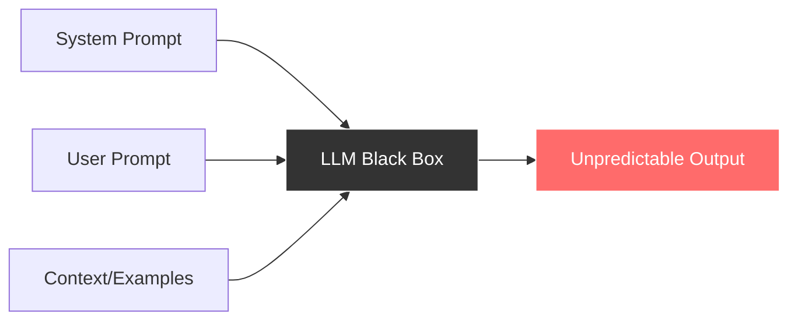

**Key Issues:**

- Multiple inputs, uncertain outputs
- 100+ LLM providers (OpenAI, Anthropic, Cohere, local models...)
- Same prompt = different results across models
- Temperature, top-p, and other knobs add complexity

::: notes

This is the fundamental problem we're solving. LLMs are black boxes from a
developer perspective. We put stuff in, we get stuff out, but there's no
systematic way to improve the relationship between input and output.

The complexity explodes when you consider model differences. A prompt that
works great with GPT-4 might fail completely with Claude or a local model.
We're essentially doing manual integration testing every time we switch
providers.
:::

---

## Current Development Pain Points
**"Prompt engineering doesn't feel like programming"**

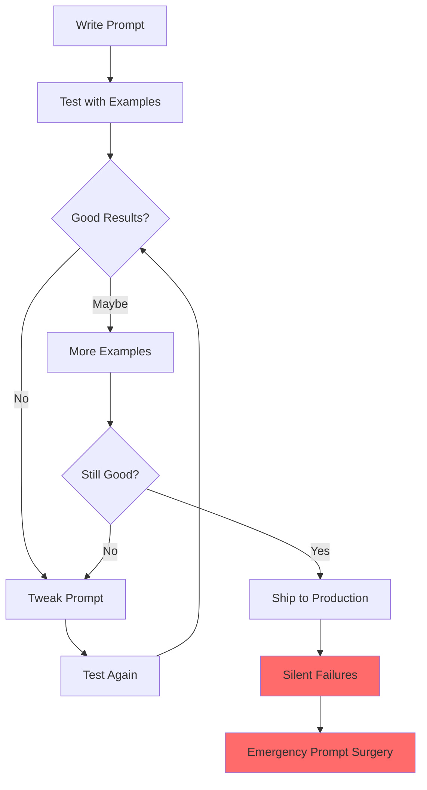

**Pain Points:**
- Prompt libraries become technical debt
- "The magic disappeared after adding one example"
- No systematic way to improve quality
- Production failures are silent and expensive
- Copy-paste programming with prompts

::: notes
This workflow should look familiar and painful. It's the opposite of everything
we've learned about software engineering best practices.

Notice the "silent failures" - this is unique to LLM applications. A
traditional API either works or throws an error. LLMs always return
*something*, but that something might be subtly wrong in ways that only surface
much later.

I call this "copy-paste programming with prompts" because that's what most of
us end up doing. Find a prompt that works on Stack Overflow, copy it, pray it
works for your use case.
:::

---

## Fundamental Limitations  
**"We're hitting the ceiling of manual optimization"**

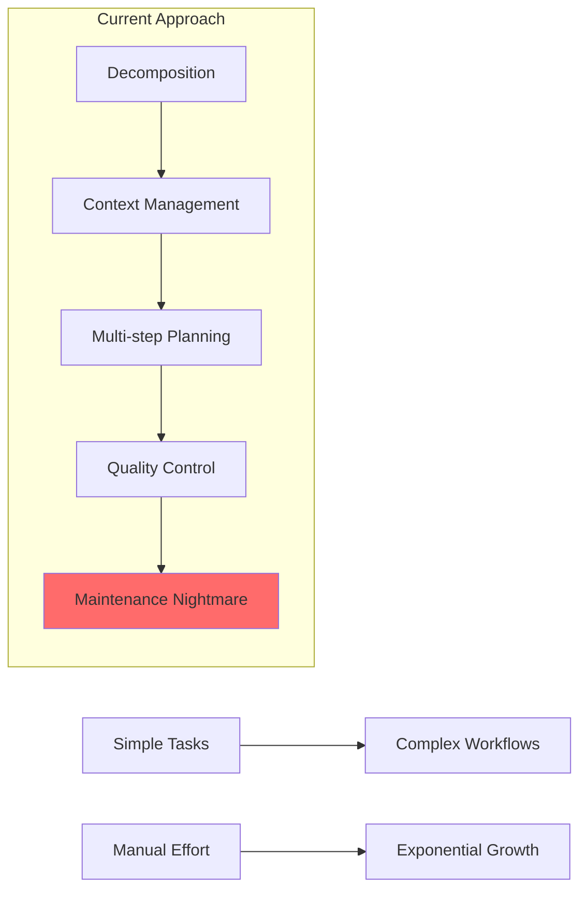

**The Hard Questions:**
- How do you summarize a 100-page document reliably?
- Context limits force awkward chunking strategies
- Multi-step reasoning requires manual orchestration
- No principled way to measure and improve quality

::: notes
These aren't just engineering problems - they're fundamental limitations of the current approach. When I say "manual orchestration," I mean you're essentially writing a state machine by hand every time you build a multi-step AI workflow.

The document summarization example is particularly painful. You chunk the document, summarize each chunk, then summarize the summaries. But how do you know if you're losing critical information? How do you know if your chunking strategy is optimal?

This is where we need to move from artisanal prompt crafting to systematic engineering.
:::

---

# II. The DSPy Mental Model
*Core concepts that make DSPy different*

---

## Signatures: Declaring What You Want
**"Define your interface, not your implementation"**

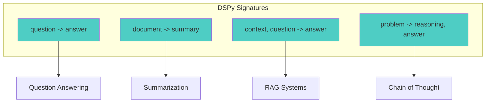

**Key Benefits:**
- Text-based: `"question -> answer"` instead of classes
- Clear input/output contracts
- DSPy figures out the prompting strategy
- Works across different LLM providers
- Composable building blocks

::: notes
This is the first major shift in thinking. Instead of writing prompts, you declare what transformation you want to happen. 

Notice these are all text-based signatures. You can use class-based signatures for more control, but start simple. The field names matter - "question" is semantically different from "query" or "input".

The magic is that DSPy takes your signature and figures out how to prompt the LM to actually do that transformation. And it can optimize that prompting strategy automatically.
:::

---

## Modules: The Transformation Layer
**"Familiar Python patterns for AI workflows"**

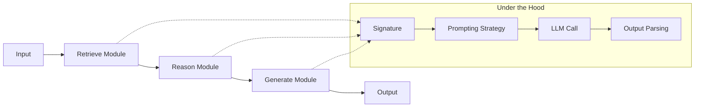

**Module Features:**
- Modules wrap signatures with behavior
- Chain modules like Python functions
- Each module optimizes its own prompting strategy
- Automatic prompt engineering per component
- Reusable across different workflows

::: notes
This should feel familiar to Python developers. Modules are like functions or classes - they encapsulate behavior and can be composed.

The key insight is that each module handles its own prompting strategy. You don't write prompts for individual modules - you just declare what each module should do via its signature.

Under the hood, each module is figuring out the best way to prompt the LM for its specific task, and this can be optimized automatically.
:::

---

## Optimization: The Magic
**"Your AI system gets better automatically"**

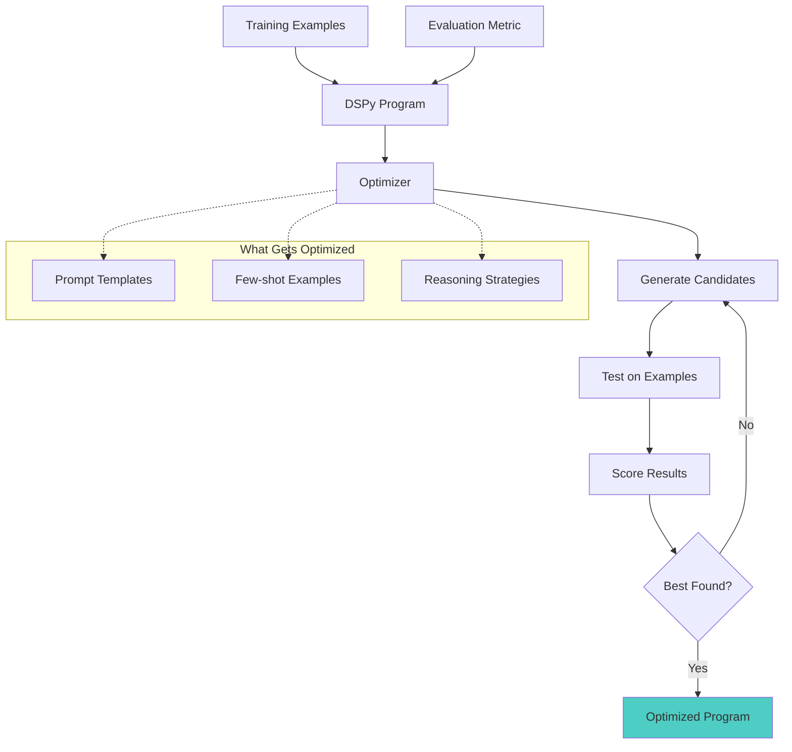

**Optimization Process:**
- Provide examples and success metrics
- DSPy searches for optimal prompting strategies
- Automatic few-shot example selection
- Cross-model optimization (OpenAI → Anthropic)
- Continuous improvement with more data

::: notes
This is where DSPy becomes truly powerful. Instead of manually tuning prompts, you provide examples of what good looks like and let DSPy figure out how to achieve it.

The optimizer is essentially doing automated prompt engineering. It's trying different ways of framing the task, selecting the best examples to include, and finding prompting strategies that work well for your specific use case.

Cross-model optimization is huge - you can develop with GPT-4 and deploy on a smaller local model, and DSPy will adjust the prompting strategy accordingly.
:::

---

# III. Live Demonstration & Comparison
*Showing the promises in action*

---

## Word Problem Solving Showcase
**"Same task, three approaches - watch the magic happen"**

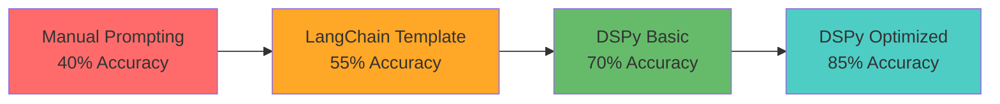

**Demo Task:** *"Sarah has 5 apples. She buys 7 more apples from the store. How many apples does Sarah have now?"*

### DSPy Code (All You Write):
```python
class MathSolver(dspy.Module):
    def __init__(self):
        self.solve = dspy.ChainOfThought("math_problem -> reasoning, answer")
    
    def forward(self, math_problem):
        return self.solve(math_problem=math_problem)

# Usage
solver = MathSolver()
result = solver("Sarah has 5 apples. She buys 7 more. How many total?")
print(f"Answer: {result.answer}")
print(f"Reasoning: {result.reasoning}")
```

::: notes
Now let's see this in action. I'm going to solve the same math problem using three different approaches, and you'll see the progression in both code simplicity and accuracy.

[LIVE DEMO]
1. Manual prompting - show the brittle string manipulation
2. LangChain template - better structure, still manual
3. DSPy basic - clean, declarative
4. DSPy optimized - same code, automatic improvement

The key insight: DSPy code doesn't change between basic and optimized. The optimization happens at the framework level.
:::

---

## Framework Positioning
**"DSPy plays well with others, but solves different problems"**

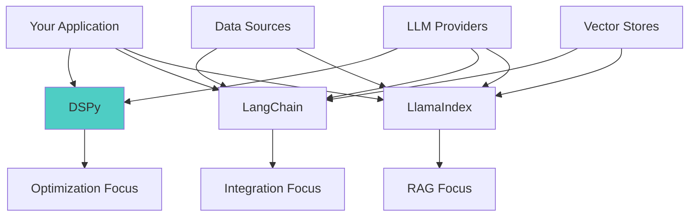

**Framework Comparison:**
- **LangChain**: Great for integrations and complex workflows
- **LlamaIndex**: Excellent for RAG and document processing  
- **DSPy**: Focus on systematic optimization and quality
- **Use together**: LangChain + DSPy, LlamaIndex + DSPy
- **Minimum viable DSPy**: 3 lines vs 30+ lines of prompt engineering

::: notes
Important clarification: DSPy isn't competing with LangChain or LlamaIndex. They solve different problems and work well together.

LangChain is your Swiss Army knife for LLM integrations. LlamaIndex is your power tool for RAG. DSPy is your optimization engine.

You might use LangChain to build your data pipeline, LlamaIndex for document retrieval, and DSPy to optimize the reasoning and generation components.

The "3 lines vs 30+ lines" isn't hyperbole. Show the math problem again - that's literally 3 lines of DSPy vs what would be extensive prompt engineering manually.
:::

---

# IV. Your Journey Forward
*Making it actionable and community-driven*

---

## Getting Started Tonight
**"You can start building with DSPy in 5 minutes"**

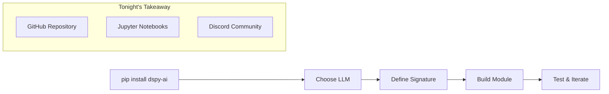

**Quick Start:**
- Minimal setup: `pip install dspy-ai`
- Works with OpenAI, Anthropic, local models, and more
- Start with simple signatures: `"input -> output"`
- Repository includes tonight's examples and setup guide
- Join the Discord for daily discussions

### Tonight's Challenge:
Pick a simple task you currently solve with prompts and rewrite it as a DSPy signature!

::: notes
Here's your homework for tonight. Don't worry about optimization yet - just get comfortable with the signature concept.

Think about any place where you're currently writing prompts. Maybe it's:
- Summarizing text
- Extracting information
- Answering questions
- Classifying content

Try to express that as a DSPy signature and basic module. Bring your experiments to July's session.

The Discord is where the real learning happens between sessions. We'll have channels for troubleshooting, sharing experiments, and discussing real-world applications.
:::

---

## The 12-Month Deep Dive
**"We're building mastery together, step by step"**

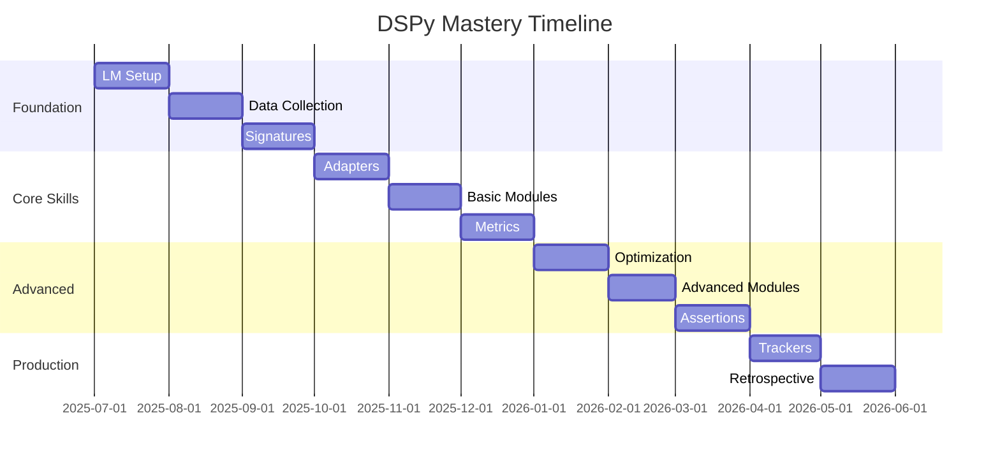

**Learning Path:**
- Each session builds on the previous
- Hands-on coding every month
- Real projects, not just examples
- Community-driven content based on your needs
- **By May 2026: Production-ready DSPy expertise**

::: notes
This timeline isn't just wishful thinking. We've structured this to mirror how you'd actually adopt DSPy in a real project.

July: Getting your development environment set up properly
August: Where do you get training data? How do you structure it?
September: Deep dive into signatures - the foundation of everything

The winter months are your core skills - modules, metrics, optimization. By January, you'll be dangerous.

Spring is about production - assertions for reliability, trackers for observability, and a retrospective where we assess how far we've come.

Notice there's no "advanced prompting" session. That's the point - DSPy abstracts that away.
:::

---

## Community Engagement
**"We're pioneering this learning path together"**

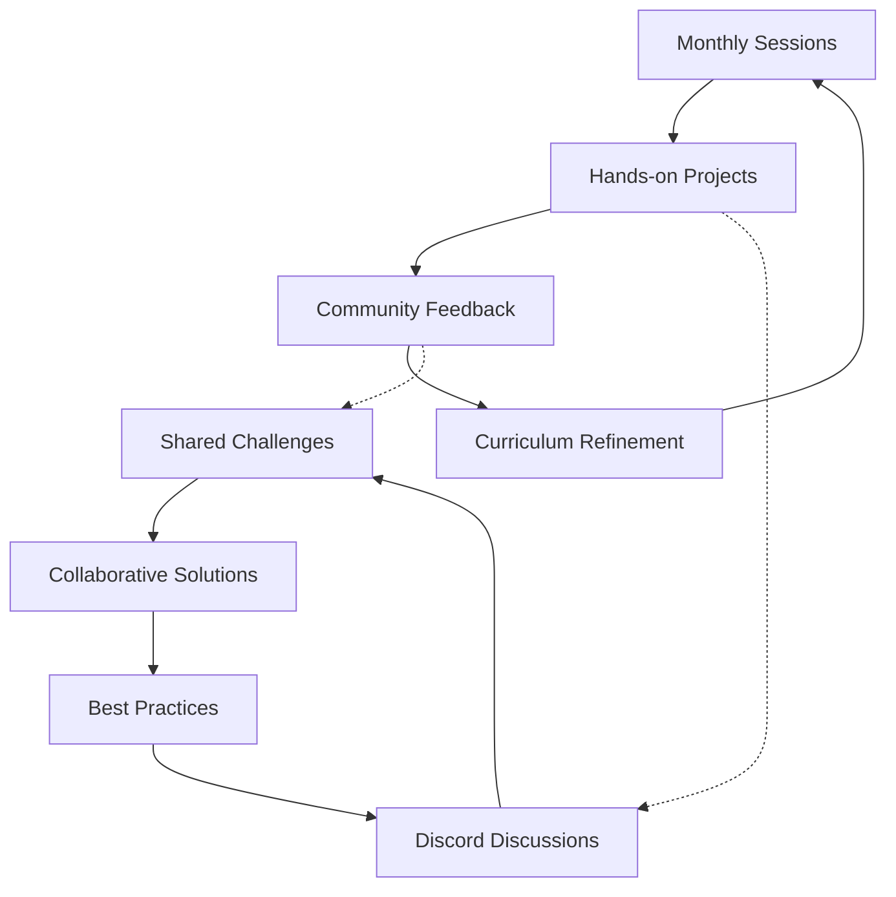

**Your Role in the Community:**
- Your questions shape future content
- Share real-world use cases and challenges  
- Discord for between-session discussions
- GitHub for code examples and contributions
- This is a collaborative learning experiment

**Call to Action:**
- Join the Discord tonight: [link]
- Star the GitHub repository: [link]
- Bring a real project challenge to July's session
- Help us pioneer systematic AI development with Python

::: notes
This is crucial - we're not just teaching DSPy, we're figuring out how to teach DSPy. The curriculum will evolve based on what you're actually trying to build.

If everyone's struggling with RAG applications, we'll spend more time there. If you're all interested in agents, we'll dive deeper into ReAct modules.

The Discord isn't just for questions - it's for sharing victories, debugging together, and building a community of practice around systematic AI development.

By the end of this journey, we'll have not just learned DSPy, but created a replicable learning path for other Python developers making the transition to AI.
:::

---

# Conclusion

## The Promise We're Making
*"Ready to wrangle some serious AI magic, Pythoneers! 🐍⚡"*

**What You'll Gain:**
- Systematic approach to AI development
- Production-ready skills, not just prototypes
- Community of practitioners solving real problems
- Confidence to build AI systems that actually work

**What We Need From You:**
- Bring real challenges, not just toy examples
- Share your failures as much as your successes
- Help shape this learning journey

**Next Steps:**
1. Install DSPy tonight: `pip install dspy-ai`
2. Join our Discord community
3. Try converting one prompt to a signature
4. Come to July's session with questions and projects

---

## Questions & Discussion

*Let's start building the future of AI development together*

**Discord:** [community-link]  
**GitHub:** [repository-link]  
**Next Session:** July 9th, 2025 - "LM Setup: Gateway to AI Services"

::: notes
Alright, let's open this up. I want to hear:

1. What AI problems are you currently trying to solve?
2. Where do you get stuck with current tools?
3. What are you most excited about in this journey?
4. What are you most worried about?

Remember, this is a collaborative experiment. Your input tonight shapes what we build together over the next year.

And don't leave without joining the Discord - that's where the real learning community lives.

Ready to move beyond prompt archaeology and into systematic AI development? Let's do this! 🐍⚡
:::

---

## Presenter Notes & Setup Instructions

### Technical Setup Required:
- Python 3.9+ environment
- `pip install dspy-ai` (corrected from previous versions)
- OpenAI API key for live demos
- Backup: Local model setup (Ollama + Llama)

### Live Demo Materials:
- Math problem examples ready
- Manual prompt version prepared
- LangChain comparison code
- DSPy version with before/after optimization

### Community Links:
- Discord server: [To be created]
- GitHub repository: [To be created] 
- Session recordings: [Location TBD]

### Key Messaging Reminders:
1. **DSPy is not anti-LangChain** - emphasize complementary nature
2. **Start simple** - don't overwhelm with advanced features
3. **Real problems only** - discourage toy examples
4. **Community-driven** - this curriculum evolves based on participant needs

### Follow-up Actions:
- Create Discord server before session
- Set up GitHub repository with tonight's examples
- Prepare July session based on tonight's feedback
- Document participant challenges and questions for curriculum planning
