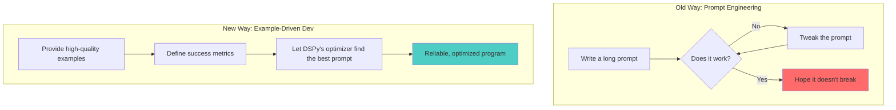
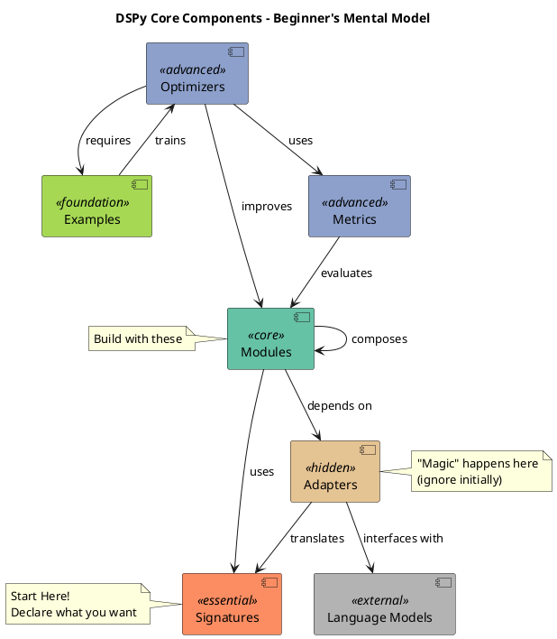

# Session 2: Data Collection - Building Training Foundations
*DSPy Mastery Series - Month 2 - August 2025*

## 1. Opening: From Prompting to Programming with Data

Welcome back! Last month, we set up `dspy.LM` as our gateway to AI models.
Today, we tackle the most critical ingredient for building reliable AI systems:
**data**.

In traditional programming, we write logic. In DSPy, we **show the AI what we
want** using examples. This is the fundamental shift from brittle prompt
engineering to systematic, example-driven development.





**Session Goals:**

- Understand the role of `dspy.Example`
- Learn to build a high-quality training set
- Structure data for optimization and evaluation

## 2. The Core Unit: `dspy.Example`

The fundamental building block of any DSPy dataset is `dspy.Example`. It's a
simple, flexible data structure that holds one instance of your task.

Think of it as a dictionary with superpowers. You can define any fields you
want, and then you tell DSPy which fields are **inputs** to your program.

```python
import dspy

# A simple example for a question-answering task
example = dspy.Example(
    question="What is the capital of France?",
    answer="Paris"
)

# Tell DSPy which field is the input
example = example.with_inputs("question")

print(f"Inputs: {example.inputs()}")
print(f"Outputs: {example.labels()}")
print(f"Question: {example.question}")
```

### Key Properties of `dspy.Example`

| Property | Description |
|---|---|
| **Flexible** | Can have any number of fields with any names. |
| **Immutable** | Methods like `.with_inputs()` return a new, modified copy. |
| **Explicit** | Clearly separates input fields from output/label fields. |
| **Accessible** | Access fields using dot notation (`example.question`) or as a dict (`example['question']`). |

## 3. Anatomy of a Good Example

The quality of your AI system is directly proportional to the quality of your
examples. A small set of high-quality examples is better than a massive set of
noisy ones.

| Pillar | What It Means | Why It Matters |
|---|---|---|
| **Representativeness** | Your examples should reflect the real-world data your program will see. | The optimizer learns patterns from your data. If your examples are too clean, the system will fail on messy, real-world inputs. |
| **Diversity** | Cover the full range of topics, formats, and edge cases for your task. | Prevents the system from overfitting to one specific type of input and ensures it can generalize well. |
| **Consistency** | Use a uniform structure and labeling convention across all examples. | The optimizer needs clear, consistent patterns to learn effectively. Mixed signals lead to poor performance. |
| **Quality** | Every example should be correct and unambiguous. | Each example is a "vote" for a desired behavior. A wrong example actively teaches the system to make mistakes. |

## 4. Practical Example: Building a Dataset

Let's build a dataset for a sentiment classification task. Our signature will be
`"text -> sentiment"`.

The `trainset` is used by the DSPy optimizer to learn how to perform the task.
It needs 10-50 high-quality examples.

```python
# A small but effective training set
trainset = [
    dspy.Example(text="I love this product, it's the best!", sentiment="Positive").with_inputs("text"),
    dspy.Example(text="This is terrible. I'm so disappointed.", sentiment="Negative").with_inputs("text"),
    dspy.Example(text="It's okay, not great but not bad either.", sentiment="Neutral").with_inputs("text"),
    dspy.Example(text="The customer service was outstanding.", sentiment="Positive").with_inputs("text"),
    dspy.Example(text="I waited for weeks and it arrived broken.", sentiment="Negative").with_inputs("text"),
    # ... add 5-10 more diverse examples
]
```
This `trainset` teaches the optimizer the desired output format ("Positive", "Negative", "Neutral") and provides
examples for the reasoning process.

## 5. From Raw Data to Training Sets

You rarely create examples from scratch. Usually, you'll transform existing
data assets.

**Common Data Sources:**
- Customer support logs
- Product reviews
- Internal documentation & FAQs
- User interaction histories
- Outputs from domain experts

When you transform this raw data, you make crucial design choices. The fields
you create in your `dspy.Example` define your system's capabilities.

- **Need citations?** Add a `sources` field to your examples.
- **Want step-by-step reasoning?** Add a `reasoning` field.
- **Handling different user types?** Add a `user_level` input field.

Your example structure **is** your system's specification.

## 6. Best Practices: Do's and Don'ts

### Do's
✅ **Start Simple, Then Add Complexity**
- Master the basic cases first before tackling edge cases.

✅ **Include "Negative" Examples**
- Show the system what *not* to do, or how to handle ambiguity.
- Example: An input with no clear sentiment could be labeled "Unclear".

✅ **Version Control Your Datasets**
- Use Git LFS or DVC to track changes to your examples just like you track code.

✅ **Document Your Assumptions**
- Write down *why* an example is labeled a certain way, especially for ambiguous cases.

### Don'ts
❌ **Don't Put Everything in One Example**
- Keep examples focused on a single concept. Don't try to teach five different edge cases at once.

❌ **Don't Blindly Trust Existing Data**
- If you're using old outputs to create examples, critically evaluate them. Don't teach the system to repeat past mistakes.

❌ **Don't Ignore Gaps**
- Actively look for what's missing in your dataset. If you only have positive and negative examples, your system will never learn to output "Neutral".

## 7. Session Wrap & Next Steps

### Key Takeaways

1.  **Examples Are Your Source Code:** In DSPy, high-quality, curated examples are more important than complex prompt strings.
2.  **Structure is Specification:** The fields you define in `dspy.Example` determine the capabilities and outputs of your AI system.
3.  **Separate Your Data:** Keep `trainset` (for teaching) and `devset` (for testing) completely separate to ensure meaningful evaluation.

### Preview of Month 3: Signatures
Next month, we'll dive deep into **Signatures**, the DSPy way of declaring
*what* you want your AI to do. We'll see how Signatures and Examples work
together to create powerful, predictable programs.

---

**Remember:** Time spent creating high-quality examples is the single best
investment you can make in building a reliable DSPy application.
