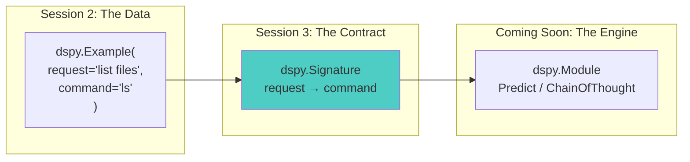
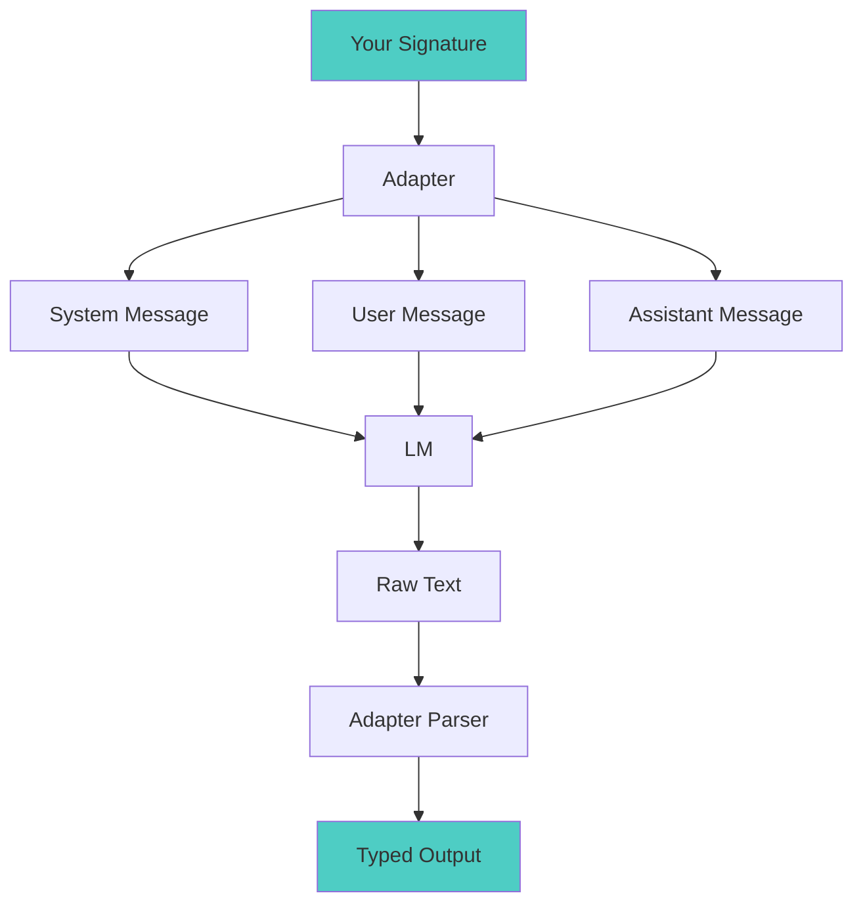
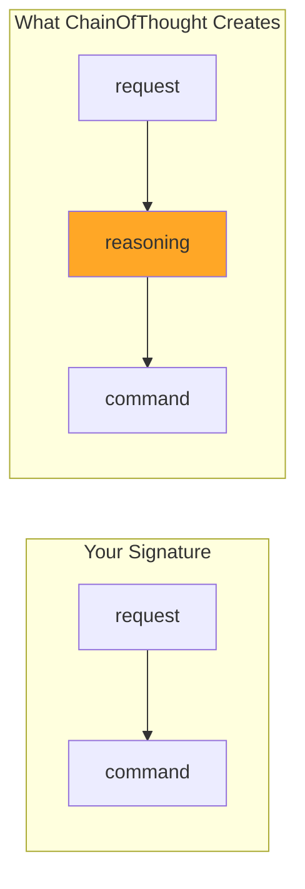

# Session 3: Signatures - Declaring What You Want
*DSPy Mastery Series - Month 3*

## 1. Opening: From Examples to Contracts

Welcome back! Last month, we built training datasets with `dspy.Example`. We
learned that the fields you define in your examples determine the capabilities
of your AI system. But there's a missing piece: **how does DSPy know which
fields are inputs and which are outputs?**

That's what signatures do. A signature is a **declarative contract** that tells
DSPy the shape of your task — what goes in, what comes out, and what the task
is about. If examples are your training data, signatures are your type system.



**Session Goals:**

- Understand what signatures are and why they replace prompt engineering
- Write both inline and class-based signatures
- Use type hints and field descriptors to constrain outputs
- See how signatures compile into actual prompts
- Connect signatures to modules like `Predict` and `ChainOfThought`

## 2. Every Prompt Is a Hidden Signature

Before DSPy, we wrote prompts like this:

```python
prompt = f"""You are a shell command assistant.
Given a natural language request, return a Unix command.

Shell: {shell}
OS: {os_name}
Working directory: {cwd}

Request: {request}

Command:"""
```

Look closely. This prompt has **four inputs** (`shell`, `os_name`, `cwd`,
`request`) and **one output** (`command`). The contract is there — it's just
buried in a string.

**What goes wrong with implicit contracts:**

| Problem | Consequence |
|---|---|
| No validation | Pass the wrong fields and get garbage out silently |
| No optimization target | DSPy can't improve what it can't see |
| Fragile formatting | One missing newline and the prompt breaks |
| Not reusable | Copy-paste the string every time you need it |
| Model-specific | Rewrite for every LLM provider |

Signatures make the implicit explicit.

## 3. Inline Signatures: The Simplest Form

The fastest way to declare a signature is with a string:

```python
import dspy

# One input, one output
predictor = dspy.Predict("question -> answer")
result = predictor(question="What is the capital of France?")
print(result.answer)  # "Paris"
```

The arrow `->` separates inputs (left) from outputs (right). Field names are
meaningful — DSPy uses them to guide the LM.

### Multiple Fields

```python
# Multiple inputs
predictor = dspy.Predict("context, question -> answer")

# Multiple outputs
predictor = dspy.Predict("question -> reasoning, answer")

# With type annotations
predictor = dspy.Predict("question: str -> answer: str, confidence: float")
```

### When to Use Inline Signatures

Inline signatures are great for:

- Quick prototyping and REPL exploration
- Simple one-input, one-output tasks
- When you don't need field descriptions or complex types

They're the `lambda` of signatures — concise but limited.

## 4. Class-Based Signatures: The Full Power

When you need more control, define a signature as a class:

```python
class EnglishToUnix(dspy.Signature):
    """Convert natural language requests into Unix commands."""

    request = dspy.InputField(desc="what the user wants to do")
    command = dspy.OutputField(desc="the Unix command to accomplish this")
```

Three things to notice:

1. **The docstring** becomes the task instructions — it tells the LM *what this
   task is about*
2. **`InputField()`** marks fields the caller provides
3. **`OutputField()`** marks fields the LM should produce

The `desc` parameter gives the LM hints about what each field means. This is
your primary tool for guiding output quality.

### Building Up: From Simple to Realistic

Let's trace the progression from inline to production-ready. Start with the
simplest version:

```python
# Inline: quick and dirty
predictor = dspy.Predict("request -> command")
```

Add structure with a class:

```python
# Class-based: clear contract
class EnglishToUnix(dspy.Signature):
    """Convert natural language requests into Unix commands."""

    request = dspy.InputField(desc="what the user wants to do")
    command = dspy.OutputField(desc="the Unix command to accomplish this")
```

Now look at a real-world signature from the **sline** case study — a shell
command assistant that needs environmental context:

```python
class ShellAssistant(dspy.Signature):
    """You are a shell command assistant. Given a natural language description
    or partial command, return ONLY a valid shell command. No explanation, no
    markdown, no code fences - just the raw command.

    Context:
    - Shell: {shell}
    - OS: {os_name}
    - Working directory: {cwd}

    Rules:
    1. Output exactly one command (may use pipes, &&, etc.)
    2. Use syntax appropriate for the specified shell
    3. Prefer common utilities available on the OS
    4. If the input is already a valid command with a typo, fix it
    5. If unclear, make a reasonable assumption"""

    shell: str = dspy.InputField()
    os_name: str = dspy.InputField()
    cwd: str = dspy.InputField()
    request: str = dspy.InputField()

    command: str = dspy.OutputField()
```

Same concept — inputs on the left, outputs on the right — but now the contract
carries real requirements: context fields, behavioral rules, and output format
constraints, all in the docstring.

## 5. Type Hints: Constraining What Comes Back

Signatures support Python type annotations. The types aren't just
documentation — DSPy uses them to validate outputs and guide the LM.

### Basic Types

```python
class MovieReview(dspy.Signature):
    """Analyze a movie review."""

    review: str = dspy.InputField()
    rating: float = dspy.OutputField(desc="rating from 0.0 to 5.0")
    recommend: bool = dspy.OutputField(desc="whether to recommend this movie")
```

### Literal Types: Constrained Classification

This is one of the most useful patterns. `Literal` restricts the output to an
enumerated set of values:

```python
from typing import Literal

class SentimentClassifier(dspy.Signature):
    """Classify the sentiment of a text."""

    text: str = dspy.InputField()
    sentiment: Literal["positive", "negative", "neutral"] = dspy.OutputField()
```

The LM can only produce one of the three listed values. No more parsing
free-text outputs and hoping they match your categories.

### Lists and Structured Types

```python
from typing import Optional

class EntityExtractor(dspy.Signature):
    """Extract named entities from text."""

    text: str = dspy.InputField()
    entities: list[str] = dspy.OutputField(desc="named entities found in the text")
    summary: Optional[str] = dspy.OutputField(desc="brief summary if text is long")
```

### Pydantic Models: Full Structured Output

For complex structured data, use Pydantic models as output types:

```python
from pydantic import BaseModel

class Entity(BaseModel):
    name: str
    type: str
    confidence: float

class EntityExtractor(dspy.Signature):
    """Extract structured entities from text."""

    text: str = dspy.InputField()
    entities: list[Entity] = dspy.OutputField()
```

DSPy will instruct the LM to produce valid JSON matching the schema, then parse
and validate it automatically.

### Field Constraints

`InputField` and `OutputField` also accept Pydantic-style constraints that get
translated into human-readable text in the prompt:

```python
class BoundedScore(dspy.Signature):
    """Score the quality of a response."""

    response: str = dspy.InputField()
    score: int = dspy.OutputField(ge=1, le=10, desc="quality score")
    justification: str = dspy.OutputField(max_length=200)
```

| Constraint | Meaning | Prompt Text |
|---|---|---|
| `gt=5` | Greater than 5 | "greater than: 5" |
| `ge=1` | Greater than or equal to 1 | "greater than or equal to: 1" |
| `lt=100` | Less than 100 | "less than: 100" |
| `le=10` | Less than or equal to 10 | "less than or equal to: 10" |
| `min_length=1` | At least 1 character | "min length: 1" |
| `max_length=200` | At most 200 characters | "max length: 200" |

## 6. Under the Hood: How Signatures Become Prompts

This is where the abstraction pays off. When you call a module, DSPy's
**adapter** compiles your signature into a prompt. You never write this prompt
yourself — but understanding the process helps you write better signatures.



### What the adapter produces

For a signature like:

```python
class QA(dspy.Signature):
    """Answer questions with short factoid answers."""

    context: list[str] = dspy.InputField(desc="relevant passages")
    question: str = dspy.InputField()
    answer: str = dspy.OutputField(desc="often between 1 and 5 words")
```

The adapter generates a **system message** with three sections:

**1. Task description** (from the docstring):
```
Answer questions with short factoid answers.
```

**2. Field descriptions** (from types and `desc`):
```
Your input fields are:
1. `context` (list[str]): relevant passages
2. `question` (str)

Your output fields are:
1. `answer` (str): often between 1 and 5 words
```

**3. Field structure** (the delimiter format):
```
[[ ## context ## ]]
{list[str]}

[[ ## question ## ]]
{str}

[[ ## answer ## ]]
{str}

[[ ## completed ## ]]
```

Then the **user message** fills in the actual values, and the adapter parses the
LM's response back into typed fields.

**The key insight:** Your docstring, field names, types, and descriptions all
flow into the prompt. Writing a good signature *is* prompt engineering — just
structured, composable, and optimizable.

## 7. Signatures Meet Modules

A signature declares *what* you want. A **module** decides *how* to get it.
Different modules implement the same signature using different strategies:

### Predict: Direct execution

```python
predictor = dspy.Predict(EnglishToUnix)
result = predictor(request="list all Python files")
print(result.command)  # "find . -name '*.py'"
```

`Predict` sends the signature to the LM as-is. Simple, fast, no extras.

### ChainOfThought: Think first, then answer

```python
thinker = dspy.ChainOfThought(EnglishToUnix)
result = thinker(request="find files larger than 100MB modified this week")
print(result.reasoning)  # "I need to combine find's -size and -mtime flags..."
print(result.command)    # "find . -size +100M -mtime -7"
```

`ChainOfThought` works by *modifying your signature* internally. It prepends a
`reasoning` output field before your declared outputs:



This is the power of the signature abstraction: modules can transform signatures
programmatically. `ChainOfThought` calls `signature.prepend("reasoning",
OutputField())` — your code doesn't change, but the LM now reasons before
answering.

### Same signature, different strategies

```python
# Direct prediction
fast = dspy.Predict(EnglishToUnix)

# With reasoning
thoughtful = dspy.ChainOfThought(EnglishToUnix)

# Same interface, same signature, different behavior
result_fast = fast(request="show disk usage")
result_thought = thoughtful(request="show disk usage")
```

Both accept the same inputs and produce the same outputs. The module chooses
the prompting strategy; the signature stays clean.

## 8. Connecting It All: Signatures + Examples

Here's how Sessions 2 and 3 fit together. Your examples and signatures share
the same field names:

```python
# The signature declares the contract
class EnglishToUnix(dspy.Signature):
    """Convert natural language requests into Unix commands."""

    request = dspy.InputField(desc="what the user wants to do")
    command = dspy.OutputField(desc="the Unix command to accomplish this")

# The examples provide training data with the SAME fields
trainset = [
    dspy.Example(
        request="list all files in the current directory",
        command="ls -la"
    ).with_inputs("request"),
    dspy.Example(
        request="show running processes",
        command="ps aux"
    ).with_inputs("request"),
    # ...
]

# The module brings them together
generator = dspy.ChainOfThought(EnglishToUnix)
```

The field names in your `dspy.Example` must match the field names in your
signature. The `with_inputs()` call on your examples mirrors the
`InputField`/`OutputField` distinction in your signature. This alignment is what
lets DSPy's optimizers (Session 7) automatically improve your system.

## 9. Best Practices

### Do

- **Use meaningful field names.** `question` is better than `input1`. The LM
  sees these names and uses them for context.
- **Write clear docstrings.** The docstring is your task description — it
  becomes the system message. Be specific about what you want.
- **Use `desc` when the field name is ambiguous.** `desc="often between 1 and 5
  words"` gives the LM a concrete target.
- **Use `Literal` for classification.** It's the cleanest way to constrain
  outputs to a known set.
- **Start inline, upgrade to class-based.** Prototype with `"question ->
  answer"`, then add structure when you need descriptions or types.

### Don't

- **Don't over-engineer signatures prematurely.** DSPy's optimizers (Session 7)
  can rewrite your instructions and select better examples automatically. Write
  something reasonable and let the optimizer refine it.
- **Don't use deprecated parameters.** `prefix`, `format`, and `parser` on
  field definitions have no effect in current DSPy. Use `desc` and type hints
  instead.
- **Don't duplicate field names across inputs and outputs.** DSPy will raise a
  `ValueError`.
- **Don't forget the docstring.** A signature without a docstring gets a generic
  default instruction. Always describe the task.

## 10. Session Wrap & Next Steps

### Key Takeaways

1. **Signatures are declarative contracts** — they define *what* your AI should
   do, not *how* to prompt it. The adapter handles prompt construction.
2. **Type hints are constraints** — `Literal`, `list`, Pydantic models, and
   numeric bounds all flow into the prompt and validate the output.
3. **Modules transform signatures** — `ChainOfThought` adds reasoning,
   `Predict` runs direct. Same signature, different execution strategy.
4. **Signatures are optimization targets** — because the contract is explicit,
   DSPy's optimizers can automatically improve instructions and examples.

### Preview of Session 4: Adapters

Next month, we'll look at **Adapters** — the translation layer between
signatures and LMs. We'll see how the same signature produces different prompts
for different models, how the `ChatAdapter` and `JSONAdapter` work, and how to
build custom adapters when the defaults aren't enough.

### Action Items

1. Rewrite an existing prompt as a class-based signature
2. Experiment with `Literal` types on a classification task
3. Try the same signature with both `Predict` and `ChainOfThought` — compare
   the outputs
4. Look at the [sline case study](../../case-studies/sline/TOUR.md) for a
   real-world signature example

---

**Remember:** A signature is worth a thousand prompts. Define the contract,
let DSPy handle the rest.
