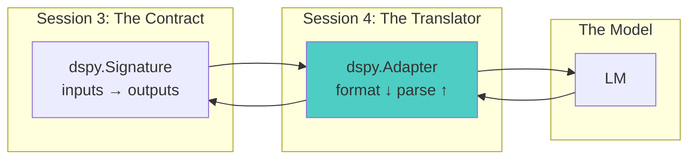

# Session 4: Adapters - The Translation Layer
*DSPy Mastery Series - Month 4*

## 1. Opening: From Signature to Wire Format

Welcome back. Last month we wrote signatures — declarative contracts that
specify *what* a task is, with input and output fields, types, and a
docstring. We saw a teaser of how a signature becomes a prompt, but we
never actually wrote that prompt ourselves. Something filled in the
`[[ ## field ## ]]` markers, formatted the demos, and parsed the LM's
reply back into typed fields.

That something is an **adapter**. An adapter is the bidirectional
translator between a typed `Signature` and the bytes that go over the
wire to an LM. The signature stays declarative and model-agnostic; the
adapter is the piece that knows how to talk to the model.



**Session Goals:**

- Understand what an adapter does and where it sits in the DSPy stack
- Read the actual prompt the default `ChatAdapter` puts on the wire
- See *why* DSPy needs an adapter layer at all — through the lens of
  pre-training and post-training
- Build a small custom adapter (the sline case study)
- Know when to swap adapters and when to leave the default alone

## 2. What Adapters Do

An adapter has four jobs:

1. **Render the system message** from the signature's docstring, field
   descriptions, and a field-structure scaffold the model fills in
2. **Render demos** (few-shot examples) in a format the model and the
   parser both agree on
3. **Render the user message** with the actual input values
4. **Parse** the LM's raw text response back into a
   `dict[field_name, typed_value]`

Recall the prompt fragment we glimpsed in Session 3:

```
[[ ## context ## ]]
{list[str]}

[[ ## question ## ]]
{str}

[[ ## answer ## ]]
{str}

[[ ## completed ## ]]
```

That was the `ChatAdapter` doing its job. The signature said nothing
about `[[ ## ## ]]` markers — the adapter chose that scheme. Different
adapters choose different schemes.

## 3. Inputs and Outputs of an Adapter

The adapter's contract has two sides — a *format* path going down to the
model and a *parse* path coming back up.

**Format path:**

```
(signature, demos, inputs) → list[ChatMessage]
```

**Parse path:**

```
(signature, completion: str) → dict[field_name, typed_value]
```

Concretely, using the `EnglishToUnix` signature from Session 3, those
two paths look like this:


The override surface — these are the methods you reach for when you
build a custom adapter:

| Method | Controls |
|---|---|
| `format_task_description` | Top of the system message |
| `format_field_description` | "Your input fields are…" block |
| `format_field_structure` | The scaffold the model fills in |
| `format_user_message_content` | User turn content |
| `format_assistant_message_content` | Assistant turn content (in demos) |
| `parse` | Inverse of the structure block |

Every adapter you'll see — the default `ChatAdapter`, the custom
`SlineAdapter`, the YAML and HTML variants we'll sketch at the end —
just picks a different combination of these methods to override. The
contract above is the contract.

## 4. Why a Translation Layer Exists at All

Before we look at any actual adapter, we need to answer a more basic
question: why does DSPy have an adapter layer in the first place? Why
not just send the signature straight to the model?

The answer comes from how modern LMs are made.

### Two regimes shape every modern LM

**Pre-training** is the first stage. The model is fed trillions of
tokens drawn from the open web and asked to predict the next token. At
this stage it has no notion of "instruction" or "answer" — it just
continues sequences. What pre-training gives the model is *latent
fluency in whatever text the web contains*.

**Post-training** is everything that happens after — instruction
tuning, RLHF, chat fine-tuning. Post-training installs the capacity to
follow your request *on command*. It shapes the model into a
conversational pattern and rewards it for matching specific behaviors.


These two regimes are not equally responsible for every aspect of model
behavior. Format adherence and content quality scale very differently.

### What pre-training actually contains

It is tempting to think of pre-training data as "text." It is far more
than that. The open web is *structured* text at enormous scale:

- HTML — every page on the web is HTML
- Markdown — every README, every wiki page, every Stack Overflow post
- JSON — APIs, configs, package manifests, scraped data dumps
- XML — RSS feeds, SVG, document formats, every legacy API
- YAML — CI configs, Kubernetes manifests, application settings
- Source code in every fenced language under the sun
- Log lines, CSV, SQL, regex patterns

By the time post-training begins, the base model is already remarkably
fluent in all of these formats at the token level. It knows tag
balance. It knows how to indent YAML. It knows that JSON keys are
quoted.

HTML is the extreme case. The model has seen tag balance, attribute
syntax, nested structure, and sloppy real-world soup billions of times
before any fine-tuning happens. Ask a sufficiently large base model to
continue an HTML document and it will, cleanly.

### The two scales — the key mental model

Here is where the framing matters. Two distinct things happen during
post-training, and they scale very differently with data.

**Format adherence saturates fast.** Getting the model to emit `<tag>`
instead of `[tag]`, to close brackets, to indent correctly, to use the
exact delimiter you asked for — these are surface behaviors. Published
experiments (Liu et al., 2024, "Revisiting the Superficial Alignment
Hypothesis") show that format-level adherence saturates with
surprisingly little post-training data, on the order of a hundred
examples. The richer the format is in pre-training, the faster it
saturates.

**Behaviors *around* the format scale as a power law.** Knowing *when*
to call a tool. Knowing *what* to put inside a tag. Knowing how to
reason inside a chain-of-thought scaffold. Knowing whether the JSON
content is correct, not just well-formed. These behaviors scale with
post-training data the same shape as pre-training scaling — a power
law in dataset size, with no obvious saturation point.

Post-training is not done after a hundred examples. It just stops being
about *format* and starts being about *capability*.


### What this means for adapters

An adapter that matches a pre-training-rich format — HTML, YAML, JSON,
Markdown — is asking the model to do the easy thing first. Emit a
shape it has already saturated on. The adapter is leaning on cheap
territory.

An adapter that invents a novel format — vendor-specific JSON schemas,
custom delimiters, DSPy's own `[[ ## field ## ]]` markers — needs a
model whose post-training mixture invested in that exact shape. There
is no pre-training base to elicit from; the adapter is depending on the
post-training mixture having seen something like it.

This is why the same adapter can perform very differently across
models. Pre-training-rich formats are roughly model-agnostic. Novel
formats are model-specific.

### The tool-calling case

You might have heard "tool calling is a post-training thing." It is
worth being precise about which part.

The *format* part of tool calling — emitting a JSON object that matches
a given schema — is elicitable from any decent instruction-tuned model
via prompt engineering alone. Recent work (Hao et al., 2024) tested
Llama-3, Gemma-2, Qwen-2, and Mistral models without any tool-specific
post-training and got clean, well-formed tool calls just by describing
the schema in the prompt. JSON itself is pre-training-rich, and "emit
JSON matching this schema" is a format-saturation task.

What is *not* elicitable that way: the judgment about *when* to call a
tool. Reasoning over the tool's output. Multi-step orchestration. Those
are behaviors *around* the format, scale with overall capability, and
benefit substantially from tool-specific post-training.

So even tool calling isn't purely a post-training story. The format is
pre-training fluency on JSON plus a small post-training nudge. The
intelligence is everything else.

### Practical heuristic

- If your format has a Wikipedia article and a w3.org spec, pre-training
  has done the format work for you. Most modern models will saturate
  on it cheaply, and the adapter's job is mostly to expose that
  fluency.
- If your format was invented in 2023 by a vendor's API team, the
  format itself is a post-training-only construct. Model choice and
  adapter design matter substantially more.
- The reasoning *inside* the format is a separate question from format
  adherence. It scales with model capability, not with adapter design.
  Don't try to fix a capability gap with an adapter swap.

## 5. Reading the Default Prompt: ChatAdapter Walkthrough

Let's make this concrete. Take the simplest possible signature from
Session 3:

```python
class EnglishToUnix(dspy.Signature):
    """Convert natural language requests into Unix commands."""

    request = dspy.InputField(desc="what the user wants to do")
    command = dspy.OutputField(desc="the Unix command to accomplish this")
```

Call the predictor:

```python
predictor = dspy.Predict(EnglishToUnix)
result = predictor(request="list all files in the current directory")
```

The default `ChatAdapter` produces this on the wire:

**System message:**

```
Your input fields are:
1. `request` (str): what the user wants to do

Your output fields are:
1. `command` (str): the Unix command to accomplish this

All interactions will be structured in the following way, with the
appropriate values filled in.

[[ ## request ## ]]
{request}

[[ ## command ## ]]
{command}

[[ ## completed ## ]]

In adhering to this structure, your objective is:
        Convert natural language requests into Unix commands.
```

**User message:**

```
[[ ## request ## ]]
list all files in the current directory

Respond with the corresponding output fields, starting with the field
`[[ ## command ## ]]`, and then ending with the marker for `[[ ## completed ## ]]`.
```

**Expected assistant response:**

```
[[ ## command ## ]]
ls -la

[[ ## completed ## ]]
```

Every block on the wire came from a specific method on the adapter:

- The "Your input fields are…" / "Your output fields are…" block came
  from `format_field_description`
- The `[[ ## request ## ]] {request}` scaffold came from
  `format_field_structure`
- The docstring at the bottom came from `format_task_description`
- The actual `list all files...` text came from
  `format_user_message_content`
- Pulling `ls -la` back out of the response came from `parse`

This is the override surface in action. Run `code/chat-adapter-prompt.py`
to see this for yourself — it calls the predictor and dumps the
compiled prompt via `dspy.inspect_history(n=1)`.

**Two-scales tie-back:** the `[[ ## field ## ]]` marker scheme is a
*novel* format. Nothing on the web looks quite like that. It works
because DSPy is in wide enough use, and the marker scheme is regular
enough, that modern post-trained chat models have effectively saturated
on it. On a very weak or very specialized model, you may see this
format break down — which is exactly when you reach for a custom
adapter.

## 6. Building a Custom Adapter: The Sline Case

Sline is a shell-command assistant. Given a request like "list files by
size," it returns `ls -lhS`. The interesting thing about sline for our
purposes is what it *doesn't* do: sline does not post-train its own
model. It selects an off-the-shelf instruction-tuned model — small
enough to run locally and offline — and shapes the prompt to match
what that model already handles well.

That is exactly the situation the two-scales framing describes. With no
post-training of your own, your best move is:

1. Pick a format that is pre-training-rich (shell prompts, shell
   commands)
2. Strip away novel formats your model wasn't specifically post-trained
   for (the `[[ ## field ## ]]` markers)
3. Let the model's pre-training fluency in shell text do the work

The custom adapter is how sline does step 2.

### The signature

```python
class ShellAssistant(dspy.Signature):
    """You are a shell command assistant. Given a natural language
    description or partial command, return ONLY a valid shell command.
    No explanation, no markdown, no code fences - just the raw command.

    Context:
    - Shell: {shell}
    - OS: {os_name}
    - Working directory: {cwd}

    Rules:
    1. Output exactly one command (may use pipes, &&, etc.)
    2. Use syntax appropriate for the specified shell
    3. Prefer common utilities available on the OS
    4. If the input is already a valid command with a typo, fix it
    5. If unclear, make a reasonable assumption"""

    shell: str = dspy.InputField()
    os_name: str = dspy.InputField()
    cwd: str = dspy.InputField()
    request: str = dspy.InputField()

    command: str = dspy.OutputField()
```

Notice the docstring already contains `{shell}` / `{os_name}` / `{cwd}`
placeholders. The adapter is going to substitute those directly into
the system message, treating the docstring as a template.

### The adapter

```python
from dspy.adapters import ChatAdapter


class SlineAdapter(ChatAdapter):
    """Produces sline-style prompts: no [[ ## field ## ]] markers,
    context substituted into the system message, raw command output."""

    def format_field_description(self, signature):
        return ""  # no field block

    def format_field_structure(self, signature):
        return ""  # no marker scaffold

    def format_task_description(self, signature):
        return signature.instructions  # docstring is the whole prompt

    def format_user_message_content(self, signature, inputs, **_):
        return str(inputs.get("request", "")).strip()

    def format_assistant_message_content(self, signature, outputs, **_):
        return str(outputs.get("command", ""))

    def parse(self, signature, completion):
        return {"command": completion.strip()}

    def format(self, signature, demos, inputs):
        instructions = signature.instructions
        for field in ("shell", "os_name", "cwd"):
            if field in inputs:
                instructions = instructions.replace(
                    f"{{{field}}}", str(inputs[field])
                )
        return [
            {"role": "system", "content": instructions},
            *self.format_demos(signature, demos),
            {"role": "user", "content": str(inputs["request"])},
        ]
```

Seven methods overridden, each doing one thing:

| Method | What it does |
|---|---|
| `format_field_description` | Returns `""` — no field block in the prompt |
| `format_field_structure` | Returns `""` — no marker scaffold |
| `format_task_description` | Returns the docstring verbatim |
| `format_user_message_content` | User turn is just the raw request |
| `format_assistant_message_content` | Demo assistant turn is just the command |
| `parse` | Whole completion is the command |
| `format` | Substitutes context placeholders into instructions |

### What sline puts on the wire

For:

```python
assistant(
    shell="zsh 5.9",
    os_name="Linux Mint 22.1",
    cwd="/home/user/projects",
    request="list files by size",
)
```

The adapter produces:

```
[SYSTEM]
You are a shell command assistant. Given a natural language description
or partial command, return ONLY a valid shell command. No explanation, no
markdown, no code fences - just the raw command.

Context:
- Shell: zsh 5.9
- OS: Linux Mint 22.1
- Working directory: /home/user/projects

Rules:
1. Output exactly one command (may use pipes, &&, etc.)
2. Use syntax appropriate for the specified shell
3. Prefer common utilities available on the OS
4. If the input is already a valid command with a typo, fix it
5. If unclear, make a reasonable assumption

[USER]
list files by size
```

The model replies `ls -lhS`. `parse()` returns `{"command": "ls -lhS"}`.

Compare to what `ChatAdapter` would have sent for the same signature: a
field-description block listing four input fields by name and type, a
marker scaffold with `[[ ## shell ## ]]`, `[[ ## os_name ## ]]`,
`[[ ## cwd ## ]]`, `[[ ## request ## ]]`, `[[ ## command ## ]]`,
`[[ ## completed ## ]]`, and a closing instruction telling the model to
start with `[[ ## command ## ]]`. Two very different shapes for one
signature.

### Why this works

The sline adapter strips the novel format that `ChatAdapter` would
otherwise impose. What remains is a prompt shape that *every*
instruction-tuned model has saturated on during post-training — shell
help text, terminal commands, a system message describing rules, a
user request, an answer. The model isn't being asked to learn a new
format on the fly; it is being asked to produce text it has already
seen billions of times.

The pre-training fluency in shell commands handles the output side.
The post-training instruction-following capacity (the kind every modern
chat model has, regardless of provider) handles the format adherence.
No model-specific training needed.

This is the pattern: when you can't change the model, change the format
to one the model already knows.

## 7. A Family of Format Adapters: YAML, HTML, and Beyond

Sline rewrites the entire prompt to escape the default marker scheme.
That's one kind of customization. There's a second, very different kind
that comes up enough to deserve its own pattern: keep the orchestration
DSPy gives you, but swap the *wire format* for inputs and outputs.

Once you've written one of these, you'll notice the same three things
keep changing — how the scaffold looks, how values are encoded into the
wire format, and how the response is parsed back. Everything else stays
the same. That's worth naming.

### The abstract base

Recall that `dspy.adapters.base.Adapter` declares six abstract methods.
We can inherit directly from it (not from `ChatAdapter`) and write a
small abstract class that fills five of them in identically for any
single-format strategy, leaving just three hooks for subclasses:

```python
class StructuredOutputAdapter(Adapter):
    name = ""  # e.g. "YAML", "HTML"

    # ---- All six Adapter responsibilities, stated explicitly ----

    def format_field_description(self, signature):
        return list_fields(signature)

    def format_field_structure(self, signature):
        return (
            f"Inputs come as {self.name}:\n\n{self.shape(signature.input_fields)}\n\n"
            f"Respond in {self.name}:\n\n{self.shape(signature.output_fields)}"
        )

    def format_task_description(self, signature):
        return signature.instructions

    def format_user_message_content(self, signature, inputs, **_):
        payload = {k: inputs[k] for k in signature.input_fields if k in inputs}
        return self.encode(payload)

    def format_assistant_message_content(self, signature, outputs, **_):
        payload = {k: outputs.get(k, "") for k in signature.output_fields}
        return self.encode(payload)

    def parse(self, signature, completion):
        return self.decode(completion, list(signature.output_fields))

    # ---- Three things subclasses customize ----

    def shape(self, fields):  raise NotImplementedError
    def encode(self, values): raise NotImplementedError
    def decode(self, completion, output_names): raise NotImplementedError
```

Three things change per format. Five are stated once and shared.

### YAML

```python
class YamlAdapter(StructuredOutputAdapter):
    name = "YAML"

    def shape(self, fields):
        return "\n".join(f"{name}: <{name}>" for name in fields)

    def encode(self, values):
        return yaml.safe_dump(values, sort_keys=False).strip()

    def decode(self, completion, output_names):
        return yaml.safe_load(completion)
```

That's the entire adapter. The wire becomes pure YAML on both sides —
inputs go up as `email: "..."`, outputs come back as
`category: billing\npriority: high\nsummary: ...`. Why YAML? Heavily
represented in pre-training (every CI config, every Kubernetes
manifest, every Rails config), so format adherence saturates cheaply.

### HTML (pure soup, no regex)

```python
class HtmlSoupAdapter(StructuredOutputAdapter):
    name = "HTML"

    def shape(self, fields):
        return "\n".join(f"<{name}>...</{name}>" for name in fields)

    def encode(self, values):
        return "\n".join(f"<{k}>{v}</{k}>" for k, v in values.items())

    def decode(self, completion, output_names):
        soup = BeautifulSoup(completion, "html.parser")
        return {n: soup.find(n).get_text("\n").strip() for n in output_names}
```

Same three-method shape. Why HTML? It is the most pre-training-rich
format in existence — every single page on the web is HTML — so even
small base models are extremely fluent in it. When this runs, the
model often picks up on the format cue and emits *more* HTML than you
asked for: `<li>` tags inside `<key_points>`, for instance.
BeautifulSoup handles that nested structure naturally, in a way that
regex would not.

### The two-pattern landscape

| Family | What changes | What stays |
|---|---|---|
| Structured-output (YAML, HTML, JSON, XML) | scaffold + encode + decode | `Adapter.format()` orchestration, field descriptions, task description, demo handling |
| Whole-prompt rewrite (sline) | `Adapter.format()`, `parse` | Almost nothing — you start from a near-blank slate |

Sline doesn't fit `StructuredOutputAdapter` because sline isn't
restructuring a payload — it's stripping DSPy's prompt machinery out of
the way and writing a hand-tuned prompt directly. Two real kinds of
adapter customization, two patterns. When you're about to write your
own, ask which kind of customization the task needs.

The code lives in three files under `code/`:
`structured_output_adapter.py` (the abstract base),
`yaml-adapter.py` and `html-soup-adapter.py` (the two subclasses, each
about a dozen lines of difference).

## 8. When to Swap Adapters, When to Stay

### Do

- **Use the default `ChatAdapter` until you have a specific reason not
  to.** It is well-tested and most modern models are saturated on its
  marker format.
- **Build a custom adapter when you're migrating from a legacy prompt
  format** you've already invested in tuning.
- **Build a custom adapter for non-standard parsing** — YAML, HTML,
  custom delimiters, raw output.
- **Lean on pre-training-rich formats** when the model is small,
  specialized, or running offline. The cheaper the format adherence,
  the more headroom for capability.
- **Start by overriding only the methods you need.** Most custom
  adapters change two or three methods, not all of them.

### Don't

- **Don't write a custom adapter to fix prompt quality.** That is what
  optimizers (Session 7) are for. Adapters change the shape of the
  prompt, not its content.
- **Don't expect an adapter swap to fix a capability gap.** Behaviors
  around the format scale with model size and post-training, not with
  adapter design. A weak model with a beautiful adapter is still a
  weak model.
- **Don't override `parse` without overriding the matching format
  method.** They are inverses. If you change one, change both.
- **Don't subclass `ChatAdapter` if you actually mean to start from
  `BaseAdapter`.** Inheriting `ChatAdapter`'s methods can sneak in
  behavior you didn't want.

## 9. Session Wrap & Next Steps

### Key Takeaways

1. **Adapters translate.** The signature stays declarative; the adapter
   knows how to talk to the model. Same signature, different adapter,
   different bytes on the wire.
2. **The default `ChatAdapter` is responsible for the markers you saw
   in Session 3.** That `[[ ## field ## ]]` scheme is the adapter's
   choice, not the signature's.
3. **Two scales, not one.** Format adherence saturates fast (around a
   hundred post-training examples), especially for pre-training-rich
   formats. Behaviors *around* the format — capability, judgment,
   reasoning — scale as a power law and don't saturate. Adapters fix
   the first, not the second.
4. **Custom adapters unlock legacy-prompt migration and let you match
   a model's existing format fluency** — sometimes by matching its
   post-trained shape, often (as with sline) by getting out of the way
   so pre-training fluency dominates.

### Preview of Session 5: Modules

Next month we'll look at **modules** — `Predict`, `ChainOfThought`,
`ReAct`, and the others. Modules sit *above* the adapter, so the
adapter abstraction lets modules stay format-agnostic. A
`ChainOfThought` doesn't care whether the underlying adapter uses
markers, YAML, or HTML; it just adds a `reasoning` field and lets the
adapter handle the rest.

### Action Items

1. Run `code/chat-adapter-prompt.py` and read the actual prompt your
   signature became
2. Read `case-studies/sline/code/sline-adapter.py` end-to-end and trace
   how each override changes the wire format
3. Sketch what a custom adapter for your own project's prompt would
   look like — which methods would you override, and which would you
   leave alone?
4. Take an existing signature and try it with both `ChatAdapter` and
   `XMLAdapter` (or one of the other built-ins) — compare the
   prompts via `dspy.inspect_history`

---

**Remember:** a signature is what you want. An adapter is how the
model gets asked for it. Pick the adapter that asks for it in a
language the model already speaks.
