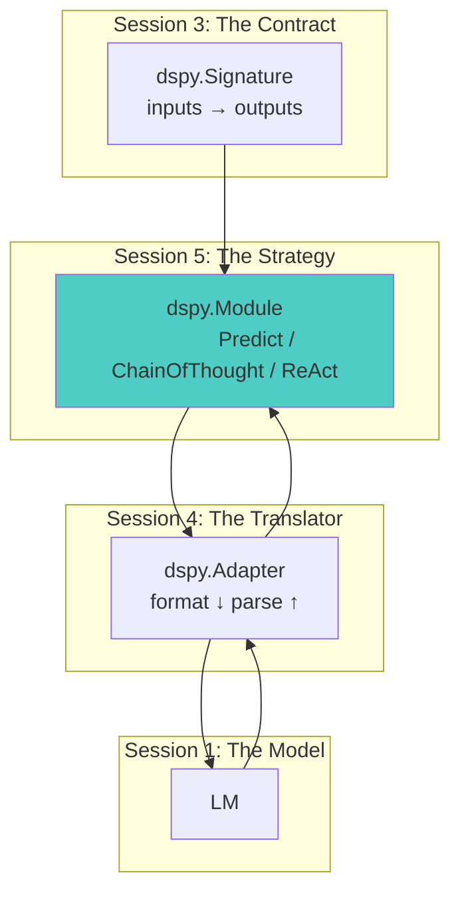
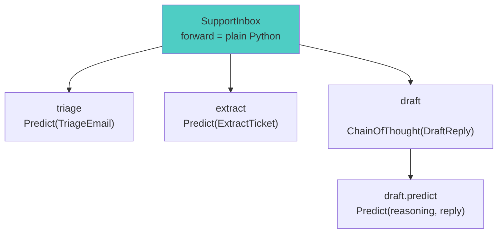

# Session 5: Basic Modules - Working AI Programs
*DSPy Mastery Series - Month 5*

## 1. Opening: From Wire Format to Working Programs

### Where We Are


Welcome back. The Foundation band is complete (Sessions 1–3), and
adapters (Session 4) opened the Core band. Modules are its center:
the piece that turns foundations into running programs.

So far, every run has been a *single predictor call*: one signature,
one prompt, one completion. Real systems classify, then branch;
extract, then draft; call tools in a loop. Real systems are
**programs**. Modules are how DSPy builds them.

Where a module sits in the call stack:



**Session Goals:**

- Understand what a module is: **a strategy plus state**
- Read `dspy.Predict` and `dspy.ChainOfThought` from the inside
- Build your first `dspy.Module` using the standard pattern from the
  sline case study
- Compose multiple predictors into a working program with plain Python
  control flow
- Save, load, and inspect a module's state, the thing Session 7's
  optimizers will write for you

## 2. What a Module Is

**A module is a strategy plus state.**

- *Strategy*: how it turns your signature into LM calls (directly,
  with a reasoning scaffold, in a tool loop)
- *State*: what it learns (demos, instructions, configuration)
- Strategy is code you can read; state is data you can save, load,
  and (starting in Session 7) optimize

The mechanics are plain Python: declare predictors as attributes in
`__init__`, orchestrate them in `forward`. The one non-obvious part
is **discovery**: DSPy finds every tunable piece by walking your
attributes. No registry, no decorator.

Signatures declare *what*; modules decide *how* (Drew Breunig's
phrasing). Session 3 was the *what*. Today is the *how*.

| The module HOLDS (state) | The module DOES (strategy) |
|---|---|
| `signature`: the contract from Session 3 | `forward(**inputs)`: orchestrate LM calls |
| `demos`: worked examples (empty until Session 7) | decide which predictors run, in what order |
| `config`: per-call LM kwargs (`n`, `temperature`) | branch, loop, run plain Python |
| `lm`: an optionally pinned model | return a `dspy.Prediction` |

## 3. Predict: The Atom

`dspy.Predict` is the smallest possible module: minimal strategy, all
the state. Everything fancier in DSPy composes this atom.

Calling `predictor(request=...)` runs five steps:

| Step | Actor | What happens |
|---|---|---|
| 1 | `__call__` | wraps the call with callbacks, usage tracking, and history, then invokes `forward` |
| 2 | `forward` | merges your inputs with the stored state |
| 3 | adapter (Session 4) | formats signature + demos + inputs into chat messages |
| 4 | LM | completes the messages |
| 5 | adapter | parses the completion into a typed `dspy.Prediction` |

The state (step 2's merge) sits on the predictor in plain sight:

```python
>>> predictor = dspy.Predict(EnglishToUnix)
>>> predictor.signature
EnglishToUnix(request -> command
    instructions='Convert natural language requests into Unix commands.'
    request = Field(annotation=str required=True json_schema_extra={'desc': 'what the user wants to do', ...})
    command = Field(annotation=str required=True json_schema_extra={'desc': 'the Unix command to accomplish this', ...})
)
>>> predictor.demos
[]
>>> predictor.config
{}
>>> predictor.lm
None
```

Four slots, four different owners:

| Slot | What it holds | Who fills it |
|---|---|---|
| `signature` | the contract from Session 3; the adapter renders its instructions into the system message | you, at construction |
| `demos` | worked examples the adapter renders as few-shot exchanges | **Session 7's optimizers**, or you by hand |
| `config` | per-call LM kwargs (`temperature`, `n`), merged over the LM's defaults | you, at construction |
| `lm` | a pinned model; `None` falls back to the global LM | `set_lm`, or nobody |

A fresh predictor has learned nothing, so everything prints empty. An
optimized predictor is the same object with `demos` filled; nothing
else changes.

Two call rules. First: calls are keyword-only.

```python
>>> predictor("show disk usage")
ValueError: Positional arguments are not allowed when calling `dspy.Predict`,
must use keyword arguments that match your signature input fields:
'request'. For example: `predict(request=input_value, ...)`.
```

Second: four kwargs never reach the model. `forward` pops each as a
one-call override of the matching state slot:

| Kwarg | Overrides | One-call effect |
|---|---|---|
| `lm=` | the `lm` slot | route this call to a different model |
| `config={...}` | the `config` slot | change sampling for this call |
| `demos=[...]` | the `demos` slot | inject few-shot examples for this call |
| `signature=` | the `signature` slot | swap the contract for this call |

The override lasts exactly one call; the stored slot never changes.
The four names are reserved: an input field named `demos` or `config`
would be swallowed by the override instead of reaching the model.

`code/predict-anatomy.py` shows the override in action, making the
same request twice:

```python
plain = predictor(request="show disk usage of each top-level directory, human readable")

demo = dspy.Example(
    request="print the current working directory",
    command="pwd  # print working directory",
)
steered = predictor(request="show disk usage of each top-level directory, human readable",
                    demos=[demo])
```

```
--- plain call: stored state only ---
command  : du -h --max-depth=1 /
type     : Prediction

--- same request, demo injected for this call ---
command  : du -h --max-depth=1  # show disk usage of each top-level directory in human-readable format
stored demos after the call: []  (the override did not persist)
```

Compare the two commands:

- Plain call: a bare command
- Steered call: a trailing comment, because the demo's command has one
  and the model imitates its examples
- `dspy.inspect_history(n=1)`: the demo rendered as a few-shot
  assistant turn (Session 4)
- Stored `demos` after both calls: still empty; the override lived
  for one call
- This is the knob optimizers turn permanently; we turned it by hand

Run `code/predict-anatomy.py` to see the whole anatomy live.

## 4. ChainOfThought: Same Contract, Different Strategy

`dspy.ChainOfThought` has a reputation as the "smart" module. Derive
it instead of reading it cold. What must it do?

- Models produce text left to right
- So reasoning must be emitted *before* the answer tokens
- "Text before the answer" is an output field ordered first
  (Session 3: field order is fill order)
- So: prepend a `reasoning` output field, run an ordinary `Predict`

That derivation is the heart of the implementation, and the heart is
two lines:

```python
extended_signature = signature.prepend(
    "reasoning", rationale_field, type_=rationale_field_type
)
self.predict = dspy.Predict(extended_signature, **config)
```

The rest is packaging. The module nearly whole (lightly trimmed from
the 2.6.27 source):

```python
class ChainOfThought(dspy.Module):
    def __init__(self, signature, rationale_field=None,
                 rationale_field_type=str, **config):
        super().__init__()
        signature = ensure_signature(signature)
        prefix = "Reasoning: Let's think step by step in order to"
        rationale_field = rationale_field or dspy.OutputField(
            prefix=prefix, desc="${reasoning}"
        )
        extended_signature = signature.prepend(
            "reasoning", rationale_field, type_=rationale_field_type
        )
        self.predict = dspy.Predict(extended_signature, **config)

    def forward(self, **kwargs):
        return self.predict(**kwargs)
```

Three design facts, each a consequence of the derivation:

1. **Composition, not inheritance.** Not a special `Predict`; it
   *holds* one at `self.predict`, with the same state slots
   (`cot.predict.demos`, `cot.predict.signature`).
2. **The strategy is one signature edit.** `reasoning` lands before
   your outputs, prefixed `"Reasoning: Let's think step by step in
   order to"`. The ordering is the whole trick.
3. **`forward` just delegates.** No prompt string anywhere.

Who renders the new field? Not `ChainOfThought`; it only edits the
signature. The adapter (Session 4) renders `reasoning` like any other
output field (markers, YAML, HTML), which is why the same module
works with every adapter.

Verify with `code/cot-under-the-hood.py`:

```
--- what CoT actually holds ---
inner predictor : Predict(StringSignature(question -> reasoning, answer
    ...
    reasoning = Field(annotation=str required=True json_schema_extra={'prefix': "Reasoning: Let's think step by step in order to", 'desc': '${reasoning}', '__dspy_field_type': 'output'})
    ...
predictor names : ['predict']
```

Same question, both modules:

```
--- same call, both modules ---
plain answer  : Let the original price be \( P \). ... The original price of the shirt was **$31.25**.
cot reasoning : Let the original price be \( P \). The shirt is sold at a 20% discount, so the sale price is 80% of the original price. Therefore, \( 0.8P = 25 \). ...
cot answer    : The original price of the shirt was $31.25.
```

What the contrast is and isn't:

- Modern models reason unprompted on math; the plain answer is itself
  chain-of-thought-ish
- The difference is **structural**: a typed `reasoning` field you can
  log, audit, and score
- The plain `Prediction` genuinely lacks the attribute (the script
  asserts both)
- CoT buys a *separated, addressable trace*, not necessarily smarter
  text

### The honest cost of CoT

- **Thesis: early CoT surfaced pre-training artifacts**
- Pre-training holds millions of worked solutions
- "Let's think step by step" (Kojima, 2022)
- Steers generation into that solution text
- DSPy's rationale prefix still quotes it
- Post-training now installs reasoning directly
- **Post-trained models: less necessary, less effective**
- Wharton (Meincke et al., 2025) measured:
- Reasoning models: zero gain, 20–80% slower
- Non-reasoning: modest gains, 35–600% slower
- **Rule: default to `Predict`**
- CoT for decomposition weak models skip
- CoT for typed, auditable traces
- sline: bare `Predict`, by design
- Session 2's CoT default: worth revisiting

## 5. Your First Module: The Sline Pattern

Time to write one. The standard pattern, verbatim from
`case-studies/sline/code/shell-assistant-signature.py`:

```python
class ShellAssistantModule(dspy.Module):
    """DSPy module wrapping the shell assistant signature.

    This is the standard pattern: wrap a Signature in a Module to enable
    optimization and composition with other modules.
    """

    def __init__(self):
        super().__init__()
        self.predict = dspy.Predict(ShellAssistant)

    def forward(self, shell: str, os_name: str, cwd: str, request: str) -> dspy.Prediction:
        return self.predict(
            shell=shell,
            os_name=os_name,
            cwd=cwd,
            request=request
        )
```

The anatomy has three rules:

1. **`__init__` declares.** Assignment IS registration:
   `named_predictors()` finds `self.predict` by walking your
   attributes. Discovery from earlier, in action.
2. **`forward` orchestrates.** Takes the task's inputs, decides what
   runs. Here: one call, straight through.
3. **Call the instance, never `forward`.** `__call__` wraps `forward`
   with callback, usage, and history plumbing (`acall`/`aforward` for
   async; same rule).

Our minimal version, `code/first-module.py`, wraps `EnglishToUnix` in
the same skeleton:

```
--- the module sees its predictors ---
predict = Predict(EnglishToUnix(request -> command
    instructions='Convert natural language requests into Unix commands.'
    ...
))
['predict']

--- it runs ---
'show disk usage of each top-level directory, human readable' -> du -h --max-depth=1 /
'grpe for TODO in python files'                  -> grep "TODO" *.py
'count the lines in every .csv file here'        -> find . -name "*.csv" -exec wc -l {} \; | awk '{total += $1} END {print total}'
```

(The model quietly fixed the `grpe` typo, sline's rule 4 in action.)

Why wrap one predictor at all? **The Module is the unit of
optimization and the unit of composition.** Session 7's compilers
take a module, not a signature; they need state slots to write into.
And the moment you need a second predictor, this skeleton is where it
goes.

## 6. Composition: Programs from Modules

One predictor is a call; a program is several predictors under plain
Python control flow. `code/email-triage-program.py` builds a support
inbox: classify an email, extract a ticket if it is a bug, draft a
reply.

| Signature | Inputs | Outputs |
|---|---|---|
| `TriageEmail` | `email` | `category: Literal["billing", "bug_report", "feedback"]`, `urgency: Literal["low", "high"]` |
| `ExtractTicket` | `email` | `summary`, `affected_component` |
| `DraftReply` | `email`, `category` | `reply` |

One module composes them:

```python
class SupportInbox(dspy.Module):
    def __init__(self):
        super().__init__()
        self.triage = dspy.Predict(TriageEmail)
        self.extract = dspy.Predict(ExtractTicket)
        self.draft = dspy.ChainOfThought(DraftReply)

    def forward(self, email):
        t = self.triage(email=email)
        ticket = None
        if t.category == "bug_report":
            # Only bug reports pay for the extraction call.
            ticket = self.extract(email=email)
        d = self.draft(email=email, category=t.category)
        reply = d.reply
        if t.urgency == "high":
            reply = "[PRIORITY] " + reply
        return dspy.Prediction(
            category=t.category, urgency=t.urgency, reply=reply, ticket=ticket
        )
```

The key claim: **`forward` is just Python.**

- Any control flow: `if`/`else`, loops, logging, non-LM code
- DSPy traces the *predictor calls*, not your syntax; no DSL, no
  graph to declare
- `extract` runs only on the `bug_report` branch
- `[PRIORITY]` is string concatenation, not an LM call

The framework still sees every tunable part:

```
--- the program's predictor tree ---
  triage
  extract
  draft.predict
```

Note `draft.predict`: a `ChainOfThought` *holds* a `Predict`, so the
discovered path goes one level down. Names are attribute paths.



Three emails through the program:

```
--- I was charged twice for my March invoice. Please r... ---
category : billing
urgency  : high
reply    : [PRIORITY] Thank you for bringing this to our attention. We apologize for the inconvenience and will

--- URGENT: the export button crashes the app for our ... ---
category : bug_report
urgency  : high
reply    : [PRIORITY] Thank you for bringing this to our attention. Our team is already investigating the issue

--- Just wanted to say the new dashboard layout is a b... ---
category : feedback
urgency  : low
reply    : Thank you for your kind words! We're glad to hear you like the new dashboard layout and appreciate y
```

The `Literal` constraints held on every run. (The model rated the
billing email `high` urgency too; whether that is *correct* is
Session 6's question.)

The discovery rules, because they gate everything later:

- `named_predictors()` walks your *attributes*, one level into lists
  and dicts of modules
- Predictors created inside `forward` or stashed in locals are
  **invisible**: to optimizers, to `save`, to `set_lm`
- They still run fine, which is exactly what makes the mistake
  dangerous

## 7. The Module Zoo

Find the strategy, find the state: now you can read any built-in.
Today we *recognize* them; Session 8 builds with the advanced ones.

| Module | Strategy | When |
|---|---|---|
| `Predict` | One adapter-formatted LM call | The default. Start here |
| `ChainOfThought` | Prepend `reasoning`, delegate to `Predict` | Multi-step logic on small/non-reasoning models; auditable traces |
| `ReAct` | Loop: thought → tool call → observation | The task needs tools or actions |
| `ProgramOfThought` | Have the LM write Python, execute it (needs Deno; code runs in a sandboxed interpreter) | Exact arithmetic/algorithmic answers |
| `MultiChainComparison` | Compare and reconcile M attempts you pass in (sample them yourself, e.g. `n=M`) | Hard reasoning worth the extra calls |
| `majority` | A *function*, not a module: normalize and vote over completions | Pairs with `n=k` sampling (self-consistency) |
| `BestOfN` | Sample N times, keep the highest-reward output | Inference-time quality loops (Session 9) |
| `Refine` | Sample, critique, retry with feedback | Same, sequential (Session 9) |

### ReAct: an agent in one file

`code/react-first-agent.py` builds an agent from two plain Python
functions. Plain functions *are* the tool API: `ReAct` reads each
name, type hints, and docstring into a `dspy.Tool`, then appends a
synthetic `finish` tool.

```python
agent = dspy.ReAct("question -> answer",
                   tools=[room_capacity, pizzas_needed], max_iters=5)
```

```
question : We booked the auditorium for the DSPy session and expect it to be half full. How many pizzas should we order?
answer   : You should order 23 pizzas.

--- the trajectory ---
thought_0     : To determine how many pizzas to order, I need to know the capacity of the audito...
tool_name_0   : room_capacity
tool_args_0   : {'room': 'auditorium'}
observation_0 : 120 people
thought_1     : The auditorium has a capacity of 120 people. Since it is expected to be half ful...
tool_name_1   : pizzas_needed
tool_args_1   : {'people': 60, 'slices_each': 3}
observation_1 : 23
thought_2     : I have obtained the number of pizzas needed, which is 23, based on the estimated...
tool_name_2   : finish
tool_args_2   : {}
observation_2 : Completed.
```

- The `trajectory` is a flat dict: `thought_i` / `tool_name_i` /
  `tool_args_i` / `observation_i` per turn
- The model chained both tools itself: capacity, halve it, pizza math

The reveal at the bottom of the file:

```
--- ReAct is modules composed ---
['react', 'extract.predict']
```

`ReAct` is *itself* the sline pattern: a `Predict` drives the loop, a
`ChainOfThought` extracts the final answer (hence `.predict`).
**Modules all the way down**, which is why Session 7's optimizers can
tune an agent like any other program.

### Self-consistency: n samples, one vote

`code/self-consistency.py` is four load-bearing lines:

```python
cot = dspy.ChainOfThought("question -> answer", n=5)
result = cot(question=question)
best = dspy.majority(result)
```

```
--- five sampled answers ---
sample 1  : 14
sample 2  : 14
sample 3  : 14
sample 4  : 14
sample 5  : 14

--- majority vote ---
14
```

- `n=5` flows through into the inner `Predict`: one call, five
  completions; `result.completions.answer` is a list
- `Predict` silently bumps temperature to `0.7` when `n > 1` and
  temperature is `<= 0.15`; sampling needs heat
- Unanimous here: easy problems converge rather than split
- `majority` votes on the *last* output field; `reasoning` is
  prepended, so that field is `answer`, not reasoning strings

`BestOfN` and `Refine`: inference-time quality loops scored by a
reward function you write. They replaced the old assertions API; we
meet them properly in Session 9.

## 8. Module State: What Saves, What Loads

Strategy is code; it lives in your repo. State is data; it has to
*travel*. `code/module-state.py` walks the journey.

Hand-attach a demo, exactly what a Session 7 optimizer does after
search:

```python
assistant.predict.demos = [
    dspy.Example(request="list files by size", command="ls -lhS")
]
```

```
--- dump_state ---
top-level keys : ['predict']
demos          : [Example({'request': 'list files by size', 'command': 'ls -lhS'}) (input_keys=None)]
instructions   :
'Convert natural language requests into Unix commands.'
```

Two facts to hold onto:

- **State is keyed by attribute-path names**: `['predict']` here;
  `['triage', 'extract', 'draft.predict']` for `SupportInbox`
- Signature state stores *instructions* plus each field's
  prefix/desc, so an optimizer's rewrite of your task description
  serializes too

The roundtrip: `save` to `.json` writes state-only JSON (plus a
`metadata` key with dependency versions, checked on load); `load`
pours it into a fresh instance of the same architecture:

```python
assistant.save(path)          # .json or .pkl: state only
fresh = UnixAssistant()       # same architecture, blank state
fresh.load(path)              # the learning comes back
```

```
--- save / load roundtrip ---
saved to       : unix-assistant.json (663 bytes)
fresh demos    : [{'request': 'list files by size', 'command': 'ls -lhS'}]

--- the loaded module runs ---
command        : ls -lS | head -n 6
```

- Demos go in as `dspy.Example` objects, come back as plain dicts;
  adapters format both fine
- Code and state together: `save(dir, save_program=True)` pickles the
  whole program to a directory

**Rename a predictor attribute and old saves stop loading.** If
`self.predict` becomes `self.generate`, the `"predict"` key no longer
resolves. Attribute names are part of your serialization format;
treat them so.

Three quality-of-life methods round out the module surface:

| Method | What it does |
|---|---|
| `module.inspect_history(n=1)` | a *per-module* call log, separate from the global `dspy.inspect_history`; in `module-state.py` it shows the loaded demo riding along in the prompt, live proof that state changed behavior |
| `module.batch(examples)` | parallel-threaded throughput in one line |
| `module.set_lm(lm)` / `module.get_lm()` | pin a model to every predictor this module owns, instead of the global `dspy.configure` |

This dict (demos per predictor, instructions per signature) is
**exactly what Session 7's optimizers write**: a machine that
searches for the state maximizing your metric, then hands back the
same module with the slots filled.

## 9. Best Practices

### Do

- **Start with `Predict`; add strategy only when observations demand
  it.** Upgrades answer failures you have seen, not decoration.
- **Declare every predictor as an attribute in `__init__`** (and call
  `super().__init__()`). Assignment is registration.
- **Call the instance, not `forward`.** `__call__` carries the
  plumbing.
- **Return `dspy.Prediction` from `forward`.** Keeps your module
  composable with metrics, optimizers, and other modules.
- **Use per-module `inspect_history` when debugging.** The global log
  interleaves every predictor; the module log shows one conversation.
- **Keep strategy out of the signature docstring.** If swapping
  `Predict` for `ChainOfThought` means rewriting the docstring,
  control flow leaked into the contract.

### Don't

- **Don't create predictors inside `forward`.** Invisible to
  optimizers, `save`, and `set_lm`; they run fine, so the bug is
  silent.
- **Don't add your own `reasoning` field with `ChainOfThought`.** It
  prepends one; yours will collide.
- **Don't wrap everything in `ChainOfThought`.** The Wharton numbers:
  reasoning-class models gain roughly nothing at 20–80% more time.
- **Don't call `module.forward()` directly.** Skips the machinery;
  bites you in tracing or optimization.
- **Don't rename predictor attributes after shipping saved state.**
  State keys are attribute paths; renames orphan every save.
- **Don't fix a strategy problem with prompt wording.** Pick the
  right module, then let optimizers (Session 7) tune the words.

## 10. Session Wrap & Next Steps

### Key Takeaways

1. **A module is a strategy plus state.** `Predict` is the atom:
   minimal strategy, all the state slots.
2. **`ChainOfThought` is composition over `Predict`.** One prepended
   `reasoning` field; the adapter renders it. Not always the better
   strategy.
3. **Programs are modules plus plain Python.** `forward` is ordinary
   code; DSPy discovers tunable parts by walking attributes, one
   level deep.
4. **State serializes, and state is what optimizers write.** A
   path-keyed dict that roundtrips through JSON into a fresh
   instance. Session 7 fills those slots.

### Preview of Session 6: Metrics

Next month we measure. A metric is a plain function,
`metric(example, prediction, trace=None)`, and it is the fitness
function Session 7's optimizers maximize. We climb from exact match
to sline's three-tier metric (exact, then normalized, then an LLM
judge; see `case-studies/sline/code/metrics-example.py`) and confront
the rule that makes Session 7 possible: **a module you can't score is
a module you can't optimize.**

### Action Items

1. Run `code/first-module.py` and `code/email-triage-program.py`;
   trace each printed predictor name back to its attribute
2. Refactor a script of your own into a `dspy.Module`: predictors in
   `__init__`, control flow in `forward`
3. Read `case-studies/sline/code/shell-assistant-signature.py`
   end-to-end, then part 2.4 of the sline `TOUR.md`
4. Swap `Predict` ↔ `ChainOfThought` on one of your signatures and
   compare the prompts with `dspy.inspect_history`

---

**Remember:** a signature is what you want. A module is how you ask:
a strategy carrying state. A program is strategies composed with plain
Python. Write the flow yourself, and leave the state for the machines.
